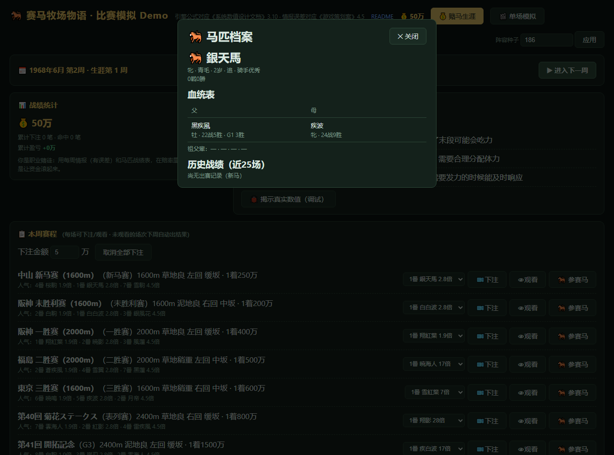
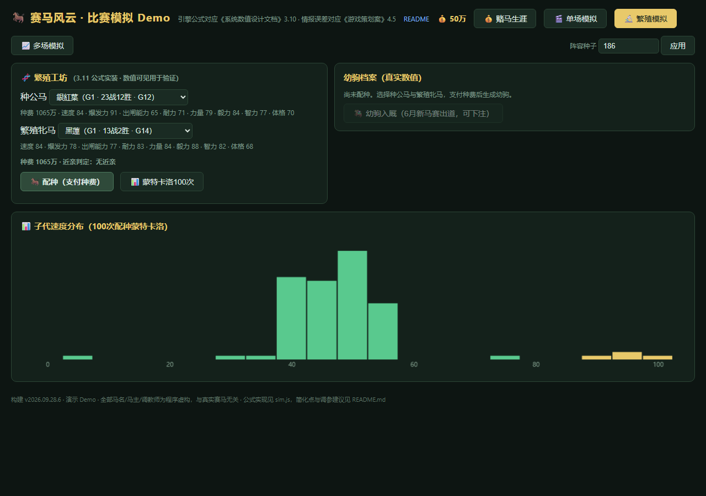
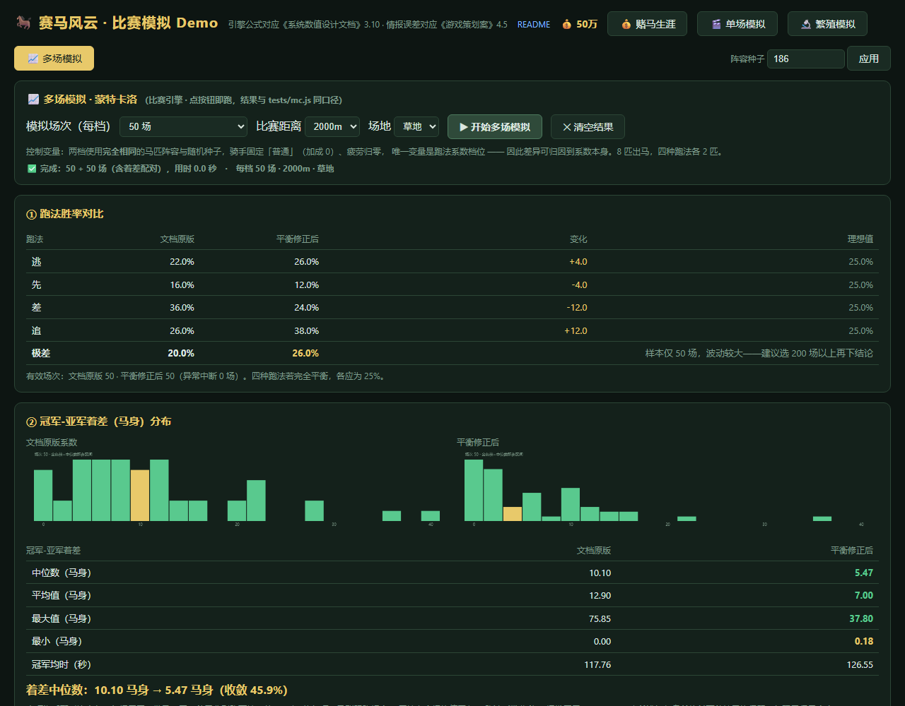

# 赛马风云 · 可玩原型（作品集）

> **一句话**：一个"信息差博弈"的赛马赌徒模拟——所有马匹数值对玩家隐藏，你只能用有误差的情报和战绩表在赔率里寻找价值。

**在线试玩**：👉 https://aaaa957.github.io/saima-bokujou/
**策划案与数值文档**：[docs/赛马风云游戏策划案.pdf](docs/赛马风云游戏策划案.pdf) · [docs/系统数值设计文档.pdf](docs/系统数值设计文档.pdf)

---

## 30 秒玩法

- 1968 年 6 月开局，52 周/年的真实赛程日历：新马赛（6~12月）、未胜利、一胜~三胜、表列赛、G3/G2/G1（G1 压轴），全年约 356 场
- 每周情报会点评赛程中的马——**但有误差**（相马眼/洞察力等级决定误差大小），赛后揭穿 ✓/✗
- 六种马券：単勝/複勝/馬連/馬単/三連複/三連単，赔率由单胜赔率推导
- 马群 70+ 匹自运转：战绩逐场累积、每年老化退役、**新马由繁殖公式生成**——你压中的超马可能伤退，两年后它的儿子会带着它的血统出现在新马赛
- 观赛是转播视角：镜头跟马群、过弯跑道转弯、実況解说
- 每周生活费 -1万，破产可重置——随机下注期望回报 83%，**看穿情报才能活**






## 四个模式

| 模式 | 内容 |
|---|---|
| 💰 赌马生涯 | 核心玩法：看情报 → 下注 → 观赛 → 周结算 → 交生活费 |
| 🔬 繁殖模拟 | 公式验证工具：选父母马配种，看幼驹真实数值 + 蒙特卡洛分布图，幼驹可入厩追踪 |
| 🎬 单场模拟 | 比赛引擎沙盒：自由编辑每匹马的隐藏数值，切换"文档原版/平衡修正"系数对比 |
| 📈 多场模拟 | 数值验证台：一键跑几十到几千场比赛，出跑法胜率表与着差直方图（见下） |

## 验证报告

### 在游戏里亲手跑：📈 多场模拟

顶栏第四个标签 **📈 多场模拟** 是一个内置的蒙特卡洛验证台：选场次（50 ~ 2000）→ 点「开始多场模拟」，
浏览器里直接跑完整比赛引擎，实时出**跑法胜率表**与**冠军-亚军着差直方图**。

要验证的结论是这条：**调参前后，四种跑法的胜率向 25% 收敛，着差量级回到真实赛马水平。**

默认 200 场（点开就是这个档），跑出来是这样：

| | 逃 | 先 | 差 | 追 | 极差 |
|---|---|---|---|---|---|
| 文档原版系数 | 18.6% | 24.8% | 30.6% | 25.9% | **54.5%** |
| 平衡修正后 | 35.9% | 33.0% | 12.6% | 18.6% | **15.5%** |

| 冠军-亚军着差 | 文档原版 | 平衡修正后 |
|---|---|---|
| 中位数（200 对） | 8.17 马身 | **5.39 马身** |

修复项：马群跟跑耦合 + 属性向全场均值回归 + 跑法系数收敛 + 爆发因子 0.25→0.20。

> ⚠️ 上面这组数字是"比赛公式重做"之前测得的，公式重做后着差量级已变化，
> 待重新标定后再更新（见下方"耐力 = 可跑距离"一节）。

### 耐力 = 可跑距离（3.10 重做）

耐力不再是抽象数值，而是**能跑多远**：

```
可跑距离 = 耐力 × 32 米 × (场地修正 × 力量修正)

耐力  50 → 1600m     70 → 2240m     80 → 2560m
耐力  90 → 2880m    100 → 3200m
```

实测（`node tests/stamina-range.js`，真实 8 匹马比赛）误差 **+1.3% ~ +3.5%**：

| 耐力 | 名义可跑 | 实测耗尽点 | 误差 |
|---|---|---|---|
| 50 | 1600m | 1620m | +1.3% |
| 70 | 2240m | 2298m | +2.6% |
| 100 | 3200m | 3275m | +2.3% |

修正项：

| 因素 | 效果 |
|---|---|
| 场地 良/稍重/重/不良 | 系数 1.00 / 0.95 / 0.88 / 0.80 |
| 力量 | **只在烂地生效**：良地极差 18m，不良地极差 129m（力量90 vs 50） |

代价：**耐力不足的马会被允许跑崩**——耐力 50 跑 3000m 会在 1600m 处力竭，
之后明显失速。这是刻意的设计：玩家看到马跑崩，自己就不会再安排它跑那个距离，
比硬性报名门槛更贴近现实。实测 3000m 二十场**无中止**，跑崩表现为大幅变慢。

### 耐力/毅力豁免"属性向均值回归"

原来的 35% 均值回归是为旧结构（所有属性只影响 base）调的。
若施加在耐力上会把"能跑多远"也抹平——实测耐力 50/100 的可跑距离
从名义 1600/3200m 被压成 1888/2880m（区间 1.53 倍 vs 名义 2 倍）。
"耐力 90 = 能跑 2880 米"必须是确定事实，不能因同场对手强弱而变，故豁免。

### 比赛公式重做（属性不再由速度独裁）

原公式下**只有速度有意义**：速度 +20 的胜率 +59.7 个百分点，而
耐力 +20 = **+0.0**、毅力 +20 = +1.3、爆发力 +20 = +2.7、力量 +20 = +4.3——
策划案 4.1 写的"多属性共同构成能力"在实现里并不成立。

根因有两个，都已在代码里注明：

1. **所有属性只影响 `base`，而 `base` 乘以风格系数作用于全程五个阶段。**
   风格系数差（±7%）远大于属性差（速度 ±1.5%），于是比赛由跑法决定。
2. **耐力没有可用机制**：毅力阶段"锁定额定速度"，全程没有衰减，
   耐力池有富余时多加耐力毫无价值（实测耐力 70→90 完赛时间完全相同）。

重做后的设计：**速度定上限，耐力/毅力定"维持上限的能力"，两者由「连续掉速」连接**
（剩余耐力越低、可达速度衰减越多）——这才是现实中两者的真实关系。
属性另按阶段分配专属作用区间（出闸←出闸能力、序盘中盘←力量、后盘←毅力、终盘←爆发力）。

单项 +20 的胜率影响（`node tests/attribute-impact.js 300`）：

| 属性 | 重做前 | 重做后 |
|---|---|---|
| 速度 | +59.7 | **+30.3** |
| 出闸能力 | +7.0 | +21.3 |
| 毅力 | +1.3 | +12.3 |
| 耐力 | **+0.0** | +11.0 |
| 力量 | +4.3 | +9.7 |
| 爆发力 | +2.7 | +5.0 |
| 体格 | +0.7 | +3.3 |

同时修掉两个实测出来的缺陷：

- **速度标尺偏慢**：2000m 要 139~166 秒（现实约 120 秒）。新标尺下 2000m ≈ 133 秒。
- **车道几何错误**：`newS` 原本除以 `(1 + k·t)`，让外侧马既走更长的弧又被减速。
  实测强制道次时，贴外栏的 4 匹马胜率合计 **96.7%**（反向偏差比原来更极端）。
  现改为**车道与行进距离解耦**——横向位置只影响碰撞与走位，不影响推进。

### 人气/赔率是一个独立的市场模型

`oddsAndPopularity` 原本直接读 `h.stats`（隐藏属性），等于市场开天眼：
赔率已准确反映真实实力，玩家看穿情报也没有任何收益，信息差博弈在数学上不成立。

现在市场是独立模块，**只吃公开信息**（战绩、骑手、血统、年龄、适性、体格），
并带群体偏差（连胜溢价、新马低估、血统轻视、名骑手光环）——
这些偏差就是玩家可以学会并利用的"市场规律"。

引擎修好后，市场准度同步改善：**市场概率与真实胜率的相关系数 0.169 → 0.304**
（`node tests/market.js`）。修复前引擎只有速度一个真变量，市场看不见它，必然抓不住实力。

### 为什么必须这样测

同一批马、同一种子，只切换系数档位——**因为不锁定变量就测不出系数效应**。
让那匹 +5 属性的强马轮转全部 8 个闸位（闸位对应不同跑法）后，胜率会整体漂移 12~18 个百分点，
比跑法系数本身的影响还大。这也是本模式固定 `strongIndex`、并把两档放在同一批种子上跑的原因。

### 命令行复现

```
node tests/mc.js   [跑法场次] [着差场次] [每闸位场次]   # 默认 200 2000 200
node tests/diag.js [每档场次]                          # 属性模板与强马落点诊断
node tests/mc-browser-harness.js [场次]                # 校验页面内那份代码（14 项断言）
node tests/page-smoke.js                               # 整页冒烟：启动 + 四模式切换 + MC 跑通
```

脚本只依赖 `sim.js`，纯 Node、零依赖、无构建。比赛为确定性模拟（同种子同结果），
所有数字可逐位复现；**页面模式与命令行脚本使用同一套种子推导**，
`tests/compare-page-vs-cli.js` 会逐场比对两者，确认取样完全一致。

### 繁殖公式蒙特卡洛（100 次，双 90 速度父母）

| 指标 | 实测 | 结论 |
|---|---|---|
| 早夭率 | 4.5% | 与设计目标 5% 基本一致 |
| 子代速度 | 均值 65.3 ± 10.2 | 强均值回归（权重特性），极端个体存在 |
| 状态值 | 上限 19800 | 由转换公式推导得出 |
| 种费 | G1 种马 1000 万 | 落在设计区间 800~1500 万 |

复现入口：🔬 繁殖模拟 → 选父母马 → 「📊 蒙特卡洛100次」，直方图即该次抽样结果。

## 技术说明

纯 JavaScript（零依赖、零构建），单页面 + 一个引擎文件（sim.js，约 1643 行），双击即玩；
引擎与 UI 分离，公式全部带文档章节注释。比赛为确定性模拟（同种子同结果），适合回归测试。

## 运行方式

- 在线：GitHub Pages 链接
- 本地：双击 index.html（无需服务器）

直达各模式的入口（便于演示与截图）：

| 入口 | 作用 |
|---|---|
| `#multi` | 多场模拟；加 `?mc=200` 指定场次并自动开跑 |
| `#breed` | 繁殖模拟；加 `?breedmc=1` 自动跑一次配种蒙特卡洛 |
| `#single` | 单场模拟（数值沙盒） |
| `#snap` + `?steps=N` | 推进到比赛第 N 帧后定格，用于截图 |
| `?horse=1` | 直接打开第 1 匹马的档案（也可传马 id） |
| `?autotest` | 引擎自检：跑 3 场并输出结果 |

页面底部会显示构建版本号（如 `构建 v2026.09.28.6`）。
GitHub Pages 的缓存是 10 分钟，改了却看不到新效果时，先核对这个版本号，再按 Ctrl+F5 硬刷新。

*全部马名、马主、赛事名为程序虚构。*
