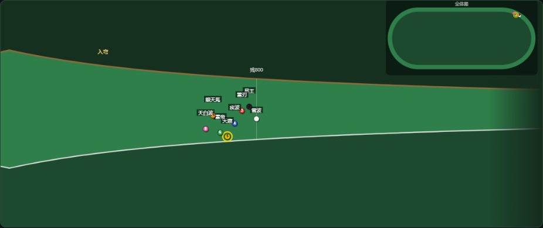

# 赛马风云 · 可玩原型（作品集）

> **一句话**：一个"信息差博弈"的赛马赌徒模拟——所有马匹数值对玩家隐藏，你只能用有误差的情报和战绩表在赔率里寻找价值。

**在线试玩**：👉 https://aaaa957.github.io/saima-bokujou/
**策划案与数值文档**：[docs/赛马风云游戏策划案.pdf](docs/赛马风云游戏策划案.pdf) · [docs/系统数值设计文档.pdf](docs/系统数值设计文档.pdf)

---

## 30 秒玩法

- 1968 年 6 月开局，52 周/年的真实赛程日历：新马赛（6~12月）、未胜利、一胜~三胜、表列赛、G3/G2/G1（G1 压轴），全年约 356 场
- 每周情报会点评赛程中的马——**但有误差**（相马眼/洞察力等级决定误差大小），赛后揭穿 ✓/✗
- 六种马券：単勝/複勝/馬連/馬単/三連複/三連単，赔率由单胜赔率推导
- 马群 70+ 匹自运转：战绩逐场累积、每年老化退役、**新马由繁殖公式生成**——你压中的超马可能伤退，两年后它的儿子会带着它的血统出现在新马赛
- 观赛是转播视角：镜头跟马群、过弯跑道转弯、実況解说
- 每周生活费 -1万，破产可重置；情报与战绩帮助你判断赔率是否有价值





## 四个模式

| 模式 | 内容 |
|---|---|
| 💰 赌马生涯 | 核心玩法：看情报 → 下注 → 观赛 → 周结算 → 交生活费 |
| 🔬 繁殖模拟 | 公式验证工具：选父母马配种，看幼驹真实数值 + 蒙特卡洛分布图，幼驹可入厩追踪 |
| 🎬 单场模拟 | 比赛引擎沙盒：自由编辑每匹马的隐藏数值，调整距离、场地、回向、起伏与赛道布局 |
| 📈 多场模拟 | 数值验证台：观察跑法冠军占比与着差分布，并用同种子配对复跑核对可复现性 |

## 生涯存档与下注规则（v2026.10.01.3）

- **自动续档**：日期、资金、马群战绩与血统、配种库、员工、本周赛程与赔率、未结算注单、情报、周回顾和待入厩幼驹都会保存在本机浏览器。下注、比赛结算、周推进、配种、入厩等操作后自动保存，也可以点击「💾 保存」。刷新后继续原生涯，破产资金不会因刷新自动重置。
- **观赛中断**：播放进度不保存，刷新后回到周界面，可以重新观看，也可以进入下一周自动结算；两种方式使用同一比赛种子。首次观看即封盘，无法事后改票或取消该场注单，未完成的比赛不会提前记为已结算。每场战绩和注单只结算一次。
- **恢复保护**：保留上一份有效存档作为备份；主存档损坏时自动尝试备份。存储不可用或空间不足会在页面提示；无法恢复或不兼容的存档会保留原数据，避免被新生涯覆盖。
- **旧版迁移**：没有完整存档时沿用旧版资金和累计下注统计；旧版未保存过的日期、马群和注单无法还原。存档只属于当前浏览器和网站地址，不跨设备同步；清除网站数据会清除存档。
- **复合马券**：必须选择所需数量的不同马匹；重复马匹、未知马匹、无效赔率不会扣款或替换已有注单。多匹券默认选择不同的马。
- **市场已接入**：生涯赛程与单场沙盒共用公开信息市场模型；不再用隐藏速度、耐力等能力直接决定赔率。赔率在下单时固定，单场沙盒未结算的下注会在刷新时退还。

## 预测、骑手规划与条件阵容（v2026.10.04.1）

骑手预测和实际执行共用运动、跟驰与供能求解器。预测沿实际路线更新加速、制动、横移、储备、持续供给、疲劳与恢复；对手仅按可见运动推断。骑手比较有限抢位、跟跑后追回、等待通道和内线路线，再从实测状态复核已承诺的动作。安全避让改写指令后，取消与新指令不符的旧承诺。跑法继续由实际位置产生，不提供速度或耗能倍率。

参赛阵容按实际距离、场地与赛级评估，保留已有马匹能力、生理与性格。新马、未胜利和条件赛分别执行游戏中的资格规则，阵容不足和补位有明确记录；不再用最快参考端排除强马。单场、生涯、自家马参赛和多场模拟使用同一条件入口。

起步响应、持续速度与耗能采用全局参数联合选择。验证对照包括冠军时间、个人末600米、前200/400/600米、途中速度代理、首末差、冠军后1/2秒完赛比例、个人末600米极差和领先者分段变化。工程检查与现实残差分别保留；小样本跑法结果仅作描述，不能据此宣称群体胜率稳定或整场节奏已拟合。

本轮代码继续保存在 `experiment/system-consistency-v9` 分支。最终源码、验证范围、逐场结果和未达标项见[比赛系统重构与联合校准](docs/比赛系统重构与联合校准-v11.md)，复现安排见[验证协议](docs/race-validation-v11-protocol.md)。大报告无损压缩保存，原始字节校验见[归档清单](docs/validation-archives-v11.json)，读取与解压方法见[复现说明](docs/v11-gzip-reproduction.md)。

## 运动交通、路线细节与个体分化（v2026.10.02.3，历史版本）

横移与跟车共同检查双方完整运动路径，使用有限制动和实际车道弧长；取消事后重写位置、瞬间清零速度的交通结算。闸位、身体包络与官方有效幅员共同约束发走，超额阵容明确拒绝。真实不可行的外部注入状态会报错，正常比赛需通过整体回归。

14个官方尺寸约束布局加入连续变曲率和实际宽度，补充东京、京都发走引入线以及已知首弯、坡段锚点。运动、耗能、骑手预算与小地图共用同一路线。平面曲率、移栏、混合内外圈和空间地面状态仍存在代理，不能称测绘复刻。[路线来源与范围](docs/route-detail-v2026.10.02.3.md)

马匹保存持续供给、短时容量与释放功率、经济性、供能建立和疲劳耐受的个体档案；旧马稳定迁移，训练不重新抽取，繁育与存档传递档案。不增加跑法或逐距离补偿倍率。[个体分化与依据](docs/individual-physiology-v2026.10.02.3.md)

新旧同阵容、同种子的系统配对与额外2022年官方参照见[系统一致性与节奏诊断](docs/系统一致性与节奏诊断-v2026.10.02.3.md)。该报告同时保留首末差、紧密完赛比例、末600分化与200米速度形状的现实残差；工程一致性通过不能解释为整场比赛已经拟合。[上一版现实差距评估](docs/当前比赛引擎-现实差距评估-2026-10-02.md)

270场原始主矩阵保留了最小停止余量−1.954米导致的工程检查失败。单独复查确认，遥测在分道边界使用了与求解器不同的判定，误把已有约10厘米身体侧向间距的两马记作同道。修复只复用求解器已有的边界谓词；同一场4410帧的运动、骑手、供能及完赛结果完全相同，修正停止余量为0.277米。按原门槛单列修正遥测工程检查，原始数据、失败状态和源码哈希均保留。[边界遥测审计](docs/traffic-slack-boundary-v9.json)

这轮代码作为结构修复实验构建保存在`experiment/system-consistency-v9`分支。主参照的冠军总时最大误差7.08%，仍超过原5%门槛；首末差和紧密完赛比例也未拟合。完整证据与失败项一并上传，不以本轮结果宣称正式现实标定完成。

## 实际路段、起步状态与路线预算（v2026.10.02.2，历史版本）

固定百分比的出闸、序盘、中盘、后盘、终盘条已退役。比赛显示领跑马和关注马各自所处的直道、弯道、终点直道、坡度、剩余距离及骑乘状态；跟跑、抢位、加力、收力可以在不同位置发生。低储备不再直接显示成失速，200米和末600米计时继续用于赛后分析。

骑手不再等跑过30米才允许发动，也不再在储备跌破4%时突然切换指令。起步完成由实际速度和加速响应判断，出力随余程预算与可支付功率变化。生涯观看使用当场真实阵容、马号和颜色，优先关注已下注的第一匹马，其次是参赛自家马，再其次是在跑领先马。

余程预测必须经过实际弯直接点和高程转折，再以最长40米单元积分；大幅提速时按速度进一步细化至约半秒。预测包括有限加速、制动、弯后提速、真实高差、风向、有限遮挡及有氧响应，动能只在功率中支付一次。可行性同时检查储备容量与瞬时供给，采用单元末储备作为保守功率下界，避免出现总能量够但末段出力不足的判断。

预测仍固定当前疲劳水平、车道及起始加速余力，不预知未来受阻、走位、疲劳变化或恢复；实际运动由逐帧物理执行。本轮基本数值与新旧同种子配对见[路线预算与状态验收](docs/路线预算与状态验收-v2026.10.02.2.md)，完整记录见[逐场JSON](docs/route-planning-v2026.10.02.2.json)。上一轮真实赛事误差未在本轮重新拟合，不能用基本数值回归宣称这些误差已经解决。

140场基本数值验收的9项检查全部通过，新旧冠军用时配对差中位数 **+0.261秒（+0.202%）**；15项新增机制回归通过，8个独立密集积分对照的储备误差最大 **0.201%**。但冠军着差P90从8.17升至10.80马身，官方场景单独统计也从8.92升至10.41，故不能宣称平衡整体改善。2400/3200米样本没有触发请求最大目标配速的“全力推进”标签，这不代表预算配速没有提高或马匹没有加速；后续应继续核对实际速度轨迹与真实赛事。

## 跑法退为观察标签、运动与骑乘重做（v2026.10.02.1，历史版本）

576场主矩阵、144组旧新同输入对照与54次真实参照已完成，24项工程检查全部通过。独立留出冠军—亚军着差中位数 **2.33马身**、P90 **8.78马身**，通过原定3/10门槛。真实留出冠军用时绝对误差中位数 **1.26%**；严格现实残差6项中4项通过，2023天皇赏春前600米偏慢10.35%、2025安田纪念总时间偏快5.81%仍未达标，脚本保留退出码1与 `passed: false`。[完整逐场验收](docs/race-calibration-v2026.10.02.1.json)

逃、先、差、追不再给马匹速度或耗能倍率，也不再选择能力模板。新马先生成能力与独立性格，骑手根据骑乘计划、附近步速、余程预算、空档与风险决定走位和发力，赛后按实际位置记录跑法。旧存档缺少性格时稳定补齐；原标签保留为历史资料。单场沙盒可以分别编辑骑乘计划、骑手、负重与马体重。

运动和能量统一用机械等价的比功率 W/kg、储备 J/kg：实际速度、加速动能、负重、空气阻力、坡度与弯道成本共同决定出力。持续供能逐渐建立，短时储备支付超额功率，毅力对应并行疲劳耐受；收力只允许有限恢复。跟跑只削减空气阻力，骑手会比较省力收益和丢失距离的追回成本，发动后也可以撤回、重新评估。

东京、中山、京都、阪神、新潟采用 JRA 官方周长、终点直道、高差与方向约束的 17 个草/泥地布局。距离改变发走点与圈数，坡度在经过坡段时影响做功，风速按当前行进方向投影。平面形状、引入线、移栏和混合内外圈仍有明确的近似范围。

新增 18 场 JRA 官方 G1 草地赛参照：2023/2024 用于全局参数选择，2025 单独留出。使用同一能力级别比较冠军总时间、同一冠军末600米和首马前600米，没有逐距离速度补丁。完整来源、参数依据、验证结果与边界见[本轮现实拟合记录](docs/比赛系统-现实拟合-v2026.10.02.1.md)。

既有生涯存档仍可继续使用。未完成场次会采用当前引擎计算；已经结算的战绩与马券结果、已有注单的下单赔率按存档保留。当前版本与历史版本的数值结果必须分别阅读。

## 连续出力与骑乘决策（v2026.10.01.6，历史版本）

本轮功能与机制回归通过，576场主矩阵和6场环境压力场景均正常完赛。工程数值14项中13项通过：
独立留出组的冠军—亚军着差p90为 **10.32马身**，略高于原定10马身，故标定脚本仍返回退出码1、JSON仍为 `passed: false`。
核心更新已可玩，严格数值标定与真实比赛拟合尚未完成。[完整逐场结果](docs/race-calibration-v2026.10.01.6.json)

骑手选择目标配速，马匹根据可用出力和加速能力逐步响应；出闸、加力、受阻后重新提速都有实际过程。
可用储备与疲劳余量随自身速度、加速、坡度和实际骑乘共同耗用，收力可减少消耗，
距离适性由能力与整场配速共同形成。耐力不再保证固定耗尽米数，毅力也不再是耐力用完后才启用的第二个油箱。

跑法表示骑手的位置与发动偏好。步速随实际领放和近距离争抢变化，冲刺时机由余力、剩余距离和路线决定。
场地布局独立于比赛距离：同一场地可以从不同起跑点跑一圈或多圈；单场沙盒可以选标准、长直道或小回り。
赛中坡度和入弯标志读取引擎使用的实际赛道，终点直道不再统一标成下坡。
生涯中的马场名称映射到这些抽象布局；当前仍不是各 JRA 马场的尺寸和高程复刻。

赛后展开「分段与骑乘回放」，可查看比赛与逐马每200米用时、冲刺发动地点、终点余力、跟跑省力和受阻时间。
计时按通过标志点的实际位置插值；比赛分段记录该点首匹马通过的时间，可能发生领头更换。
界面中的余力状态只是连续状态的提示，不表示串行的体力阶段。

`styleCoefs: 'doc' / 'balanced'` 保留为旧脚本的兼容别名，均进入当前引擎。
页面多场模拟因此改为确定性配对复跑，不再把相同模型的结果包装成「原版与平衡修正」的改进。
跑法冠军占比受阵容、赛道和临场骑乘影响，不以四种跑法各25%作为验收目标。
当前数值结果、检验口径与局限见[评估记录 §15](docs/比赛系统-现实差距评估.md#15-连续出力与骑乘决策2026-10-01v202610016)。

既有生涯存档仍可继续使用。本版本改变比赛引擎，尚未完成的场次会用当前引擎计算结果；
已结算的战绩与马券不会重新计算，已有注单的下单赔率仍按存档保留。

## 弯道与骑手修复（v2026.10.01.5，历史版本）

物理、主镜头和小地图共用 20 米赛道宽度与中线半径。弯道内移现在真正生效，
即使已进入终盘，只要还在弯道上就保留内收目标；寻找空档和突破可以改变路线。
自动靠拢与斜行动作统一限速到 0.8m/s，空档包含自身马宽，未完成的超车目标不会被下次观察清掉。
跟跑省力只在同道附近有前马时生效，新人向外避让和突破动作也与实际方向一致。

催马收益随余力衰减，末段冲刺由剩余耐力兑现。跑法系数与属性模板仍是游戏参数，
并不能据此宣称已经符合真实赛马。主镜头会平滑扩大取景以容纳后方马，小地图外道圆点与玩家光圈完整显示。
新的机制回归与逐帧镜头测试见下方命令；最新数值和未达标项见[评估记录 §14](docs/比赛系统-现实差距评估.md#14-弯道与骑手代码复核2026-10-01v202610015)。

## 验证报告（历史实验）

以下保留早期调参过程，数值与部分机制已经被后续版本替换。当前验收以 v2026.10.04.1 的比赛系统重构与联合校准报告为准；历史结果不能用作现版验证结论。

### 在游戏里亲手跑：📈 多场模拟（历史系数比较）

顶栏第四个标签 **📈 多场模拟** 是一个内置的蒙特卡洛验证台：选场次（50 ~ 2000）→ 点「开始多场模拟」，
浏览器里直接跑完整比赛引擎，实时出**跑法胜率表**与**冠军-亚军着差直方图**。

该页面比较两套跑法系数的胜率和着差；每场冠军占比受阵容构成影响，不能直接当作单匹出赛胜率。

默认 200 场（点开就是这个档），跑出来是这样：

| | 逃 | 先 | 差 | 追 | 极差 |
|---|---|---|---|---|---|
| 文档原版系数 | 18.6% | 24.8% | 30.6% | 25.9% | **54.5%** |
| 平衡修正后 | 35.9% | 33.0% | 12.6% | 18.6% | **15.5%** |

| 冠军-亚军着差 | 文档原版 | 平衡修正后 |
|---|---|---|
| 中位数（200 对） | 8.17 马身 | **5.39 马身** |

修复项：马群跟跑耦合 + 属性向全场均值回归 + 跑法系数收敛 + 爆发因子 0.25→0.20。

> ⚠️ 上面这组数字是"比赛公式重做"之前测得的，公式重做后着差量级已变化，
> 待重新标定后再更新（见下方"耐力 = 可跑距离"一节）。

### 耐力 = 可跑距离（3.10 历史机制，现版已替换）

耐力不再是抽象数值，而是**能跑多远**：

```
可跑距离 = 耐力 × 32 米 × (场地修正 × 力量修正)

耐力  50 → 1600m     70 → 2240m     80 → 2560m
耐力  90 → 2880m    100 → 3200m
```

实测（`node tests/stamina-range.js`，真实 8 匹马比赛）误差 **+1.3% ~ +3.5%**：

| 耐力 | 名义可跑 | 实测耗尽点 | 误差 |
|---|---|---|---|
| 50 | 1600m | 1620m | +1.3% |
| 70 | 2240m | 2298m | +2.6% |
| 100 | 3200m | 3275m | +2.3% |

修正项：

| 因素 | 效果 |
|---|---|
| 场地 良/稍重/重/不良 | 系数 1.00 / 0.95 / 0.88 / 0.80 |
| 力量 | **只在烂地生效**：良地极差 18m，不良地极差 129m（力量90 vs 50） |

代价：**耐力不足的马会被允许跑崩**——耐力 50 跑 3000m 会在 1600m 处力竭，
之后明显失速。这是刻意的设计：玩家看到马跑崩，自己就不会再安排它跑那个距离，
比硬性报名门槛更贴近现实。实测 3000m 二十场**无中止**，跑崩表现为大幅变慢。

### 耐力/毅力豁免"属性向均值回归"

原来的 35% 均值回归是为旧结构（所有属性只影响 base）调的。
若施加在耐力上会把"能跑多远"也抹平——实测耐力 50/100 的可跑距离
从名义 1600/3200m 被压成 1888/2880m（区间 1.53 倍 vs 名义 2 倍）。
"耐力 90 = 能跑 2880 米"必须是确定事实，不能因同场对手强弱而变，故豁免。

### 比赛公式重做（属性不再由速度独裁）

原公式下**只有速度有意义**：速度 +20 的胜率 +59.7 个百分点，而
耐力 +20 = **+0.0**、毅力 +20 = +1.3、爆发力 +20 = +2.7、力量 +20 = +4.3——
策划案 4.1 写的"多属性共同构成能力"在实现里并不成立。

根因有两个，都已在代码里注明：

1. **所有属性只影响 `base`，而 `base` 乘以风格系数作用于全程五个阶段。**
   风格系数差（±7%）远大于属性差（速度 ±1.5%），于是比赛由跑法决定。
2. **耐力没有可用机制**：毅力阶段"锁定额定速度"，全程没有衰减，
   耐力池有富余时多加耐力毫无价值（实测耐力 70→90 完赛时间完全相同）。

重做后的设计：**速度定上限，耐力/毅力定"维持上限的能力"，两者由「连续掉速」连接**
（剩余耐力越低、可达速度衰减越多）——这才是现实中两者的真实关系。
属性另按阶段分配专属作用区间（出闸←出闸能力、序盘中盘←力量、后盘←毅力、终盘←爆发力）。

单项 +20 的胜率影响（`node tests/attribute-impact.js 300`）：

| 属性 | 重做前 | 重做后 |
|---|---|---|
| 速度 | +59.7 | **+30.3** |
| 出闸能力 | +7.0 | +21.3 |
| 毅力 | +1.3 | +12.3 |
| 耐力 | **+0.0** | +11.0 |
| 力量 | +4.3 | +9.7 |
| 爆发力 | +2.7 | +5.0 |
| 体格 | +0.7 | +3.3 |

同时修掉两个实测出来的缺陷：

- **速度标尺偏慢**：2000m 要 139~166 秒（现实约 120 秒）。新标尺下 2000m ≈ 133 秒。
- **车道几何错误**：`newS` 原本除以 `(1 + k·t)`，让外侧马既走更长的弧又被减速。
  实测强制道次时，贴外栏的 4 匹马胜率合计 **96.7%**（反向偏差比原来更极端）。
  当时采用**车道与行进距离解耦**。现版已恢复方向正确的弧长换算，由 `laneBias` 调节强度。

### 人气/赔率是一个独立的市场模型

`oddsAndPopularity` 原本直接读 `h.stats`（隐藏属性），等于市场开天眼：
赔率已准确反映真实实力，玩家看穿情报也没有任何收益，信息差博弈在数学上不成立。

现在市场是独立模块，**只吃公开信息**（战绩、骑手、血统、年龄、适性、体格），
并带群体偏差（连胜溢价、新马低估、血统轻视、名骑手光环）——
这些偏差就是玩家可以学会并利用的"市场规律"。

引擎修好后，市场准度同步改善：**市场概率与真实胜率的相关系数 0.169 → 0.304**
（`node tests/market.js`）。修复前引擎只有速度一个真变量，市场看不见它，必然抓不住实力。

### 为什么必须这样测

同一批马、同一种子，只切换系数档位——**因为不锁定变量就测不出系数效应**。
让那匹 +5 属性的强马轮转全部 8 个闸位（闸位对应不同跑法）后，胜率会整体漂移 12~18 个百分点，
比跑法系数本身的影响还大。这也是本模式固定 `strongIndex`、并把两档放在同一批种子上跑的原因。

### 当前版本命令行复现

发布夹具保存了冻结源码哈希；以下回归会核对当前文件与该哈希。页面检查需要可用的 Playwright 和 Edge。完整数值矩阵的运行、已有结果审计与报告重建命令见[验证协议](docs/race-validation-v11-protocol.md)；这些任务运行时间较长。

```powershell
$raceReleaseSha = (Get-Content -Raw tests/fixtures/race-release-v11.patch | ConvertFrom-Json).finalEngineHash
node tests/cohort-fixture-proof-v11.js
node --max-old-space-size=192 tests/entry-regressions-v11.js --browser
node --max-old-space-size=192 tests/final-engine-regressions-v11.js --run --expected-source $raceReleaseSha
node tests/report-system-v11-checks.js
node tests/archive-readers-v11-checks.js
```

### 历史与扩展验证入口

以下保留旧版实验及额外压力测试命令。带归档源码的命令验证相应历史构建，不能作为当前版本验收；重新试算请另存输出，保留历史记录。

```powershell
node tests/race-physics.js                             # 连续运动、局部能耗、路线与碰撞机制
node tests/traffic-consistency-v9.js                    # 同步横移、有限跟车与病理种子回放
node tests/traffic-domain-review-v9.js --source-archive docs/system-numeric-source-3b837b-v9.js.gz --reference-source docs/system-heading-source-ac9dc7-v9.js.gz
node tests/traffic-optimized-final-v9.js --source-archive docs/system-numeric-source-3b837b-v9.js.gz # 参考固定为ac9归档，6前缀+1200/3200整场
node tests/route-heading-junction-v9.js --source-archive docs/system-numeric-source-3b837b-v9.js.gz
node tests/route-detail-v9.js                          # 路线曲率、弧长、幅员与锚点一致性
node tests/individual-physiology.js                    # 独立生理通道、遗传与稳定迁移
node tests/physiology-save.js                          # 个体档案存档保护与旧档兼容
node tests/system-reality-v9.js --mode baseline --workers 2 --out docs/system-baseline-v2026.10.02.3.json
node tests/system-reality-v9.js --source-archive docs/system-numeric-source-3b837b-v9.js.gz --workers 2 --out docs/system-current-v2026.10.02.3.json
node tests/system-reality-v9.js --scope external2022 --mode baseline --out docs/system-baseline-external2022-v2026.10.02.3.json
node tests/system-reality-v9.js --source-archive docs/system-numeric-source-3b837b-v9.js.gz --scope external2022 --out docs/system-current-external2022-v2026.10.02.3.json
node tests/system-reality-report-v9.js                  # 按真实场次聚合，不将三次种子当三场现实赛事
node tests/tempo-system-v9.js --source-archive docs/system-numeric-source-3b837b-v9.js.gz
node tests/path-isolation-v9.js --source-archive docs/system-numeric-source-3b837b-v9.js.gz
node tests/start-system-v9.js --source-archive docs/system-numeric-source-3b837b-v9.js.gz
node tests/pace-covariance-v9.js --source-archive docs/system-numeric-source-3b837b-v9.js.gz # 只读前段/末段抵消分析
node tests/effort-history-v9.js --source-archive docs/system-numeric-source-3b837b-v9.js.gz # 出力史诊断，未匹配条件保留为失败
node tests/source-snapshot-equivalence-v9.js            # 两行入口和一处遥测：整源逆补丁与6距离等价
node tests/traffic-slack-boundary-v9.js                 # 4410帧边界遥测与运动/账本完全等价审计
node tests/roster-physiology-entry-v9.js                # 旧连续马群入口的档案迁移与拷贝
node tests/write-system-report-v9.js                    # 完整数据与哈希检查后生成诊断报告
node tests/rider-route-planning.js                      # 起步、路线/功率预算与独立密集积分
node tests/route-planning-calibration.js --json docs/route-planning-v2026.10.02.2.json --markdown docs/路线预算与状态验收-v2026.10.02.2.md
node tests/race-calibration-v7.js --per-cell 2 --json race-calibration-current.json # 扩展检查；勿覆盖历史验收JSON
node tests/realism.js 96                               # 同一验收入口；每距离/种子组96场（含场地/路面/阵容分组）
node tests/fit-race-physiology.js --json race-fit-development.json # 仅2023/24训练参照，12候选参数，进程内试算
node tests/rider-strategy.js                           # 标签隔离、滚动预算、跟跑、撤回与重启
node tests/course-reality.js                           # 官方场地尺寸/高程、数据来源与分段口径
node tests/stamina-range.js 6                          # 同速同时间下的储备、场地和力量方向性检验
node tests/mc.js [跑法场次] [着差场次] [每闸位场次]     # 历史参数名保留；两档均使用当前引擎
node tests/diag.js [每档场次]                          # 属性模板与强马落点诊断
node tests/mc-browser-harness.js [场次]                # 页面MC与CLI一致性
node tests/page-smoke.js                               # 整页冒烟：启动 + 四模式切换 + MC 跑通
node tests/page-race-diagnostics.js                    # 实际赛后分段、赛道显示、存档与观赛确定性
node tests/page-race-failure-v9.js                     # 可选真实Edge回归：异常暂停、保留注单与拒绝失败结算（需要Playwright）
node tests/market-integration.js                       # 实际赛程接入市场 + 隐藏能力隔离
node tests/bet-validation.js                           # 六类马券规则 + 重复/非法注单防护
node tests/career-save.js                              # 完整存档、血统引用、备份与失败恢复
node tests/career-flow.js                              # 下注/封盘/结算/繁殖/刷新/跨年完整流程
node tests/curve-rider.js                              # 几何守恒、横移、空档、骑手与余力
node tests/camera-test.js                              # 实际绘制、完整圆点、地图遮挡、缩放
```

v9完整数值矩阵使用修复航向角跳变和安全优化后的独立归档快照`3b837b`。最终生产源码`51caabc1`相对它有两行旧连续马群档案入口修复和一处间距遥测判定修复；精确逆去这三处后整个源文件恢复为数值快照，没有排除运动或求解器区域。入口与遥测另经回归，报告保留数值源、最终代码及原始失败记录，不把旧数据重标为新哈希。[源码一致性证明](docs/source-snapshot-equivalence-v9.json) 带`--source-archive`的命令复现指定快照；主矩阵、节奏、路径和起步脚本省略该参数才测当前`sim.js`，性能与独立域审查则默认使用冻结归档。完整矩阵、节奏和路径数据全部完成后，才能运行方差分析和报告生成。密集马群的制动域计算耗时显著，完整试算可能长时间占用CPU；当前性能限制见报告。

若完整矩阵或节奏试算中断，保留输出文件，在原命令末尾加`--resume`可续跑；另加`--check-resume`只核对检查点。恢复前会检查源码、基线、协议、任务种子及已有结果身份，只执行尚未完成的任务；发现重复、外来或损坏结果则拒绝恢复。记录的耗时是已保存执行段的累计墙钟时间，不包括中断间隔或未保存的计算，不代表CPU用时。

标定脚本按六种距离、左右回向、三种抽象布局、草/泥地、实际生成与同源属性阵容分组，
使用标定种子组与独立留出种子组，`--per-cell 2` 共跑576场；另有受控机制、8场环境压力与54场官方参照试算。
JSON记录逐场测量、分组汇总、144对上一版本同输入比较、工程与现实残差验收结果及引擎SHA-256。
`realism.js`调用同一套验收逻辑；旧版第二个参数不再增加独立悬念样本。
`stamina-range.js`不再把耐力乘以32米作为耗尽点标准，失败会返回非零退出码。

镜头测试默认 2000m／左回／种子 186，可通过 `CAMERA_DISTANCE`、`CAMERA_DIRECTION`、`CAMERA_SEED` 环境变量选择场景。

核心机制与统计脚本使用仓库内的引擎、存档模块和页面源码，纯 Node、零外部依赖、无构建。真实浏览器截图与异常回归另需可被Node解析的Playwright及Edge，游戏运行不需要它们。比赛为确定性模拟（同种子同结果），
相同输入的比赛数值可逐位复现，运行耗时受硬件与并发影响；**页面模式与命令行脚本使用同一套种子推导**，
`tests/compare-page-vs-cli.js` 会逐场比对两者，确认取样完全一致。

### 繁殖公式蒙特卡洛（100 次，双 90 速度父母）

| 指标 | 实测 | 结论 |
|---|---|---|
| 早夭率 | 4.5% | 与设计目标 5% 基本一致 |
| 子代速度 | 均值 65.3 ± 10.2 | 强均值回归（权重特性），极端个体存在 |
| 状态值 | 上限 19800 | 由转换公式推导得出 |
| 种费 | G1 种马 1000 万 | 落在设计区间 800~1500 万 |

复现入口：🔬 繁殖模拟 → 选父母马 → 「📊 蒙特卡洛100次」，直方图即该次抽样结果。

## 技术说明

纯 JavaScript（零依赖、零构建），单页面 + 比赛引擎 `sim.js` + 生涯存档模块 `career-save.js`，双击即玩；
引擎、存档与 UI 分离，公式带文档章节注释。比赛为确定性模拟（同种子同结果），适合回归测试。

## 运行方式

- 在线：GitHub Pages 链接
- 本地：双击 index.html（无需服务器）

直达各模式的入口（便于演示与截图）：

| 入口 | 作用 |
|---|---|
| `#multi` | 多场模拟；加 `?mc=200` 指定场次并自动开跑 |
| `#breed` | 繁殖模拟；加 `?breedmc=1` 自动跑一次配种蒙特卡洛 |
| `#single` | 单场模拟（数值沙盒） |
| `#snap` + `?steps=N` | 推进到比赛第 N 帧后定格，用于截图 |
| `?horse=1` | 直接打开第 1 匹马的档案（也可传马 id） |
| `?autotest` | 引擎自检：跑 3 场并输出结果 |

页面底部显示构建版本号（当前代码为 `构建 v2026.10.04.1`）。
改了却看不到新效果时，先核对版本号，再按 Ctrl+F5 硬刷新。

*全部马名、马主、赛事名为程序虚构。*
