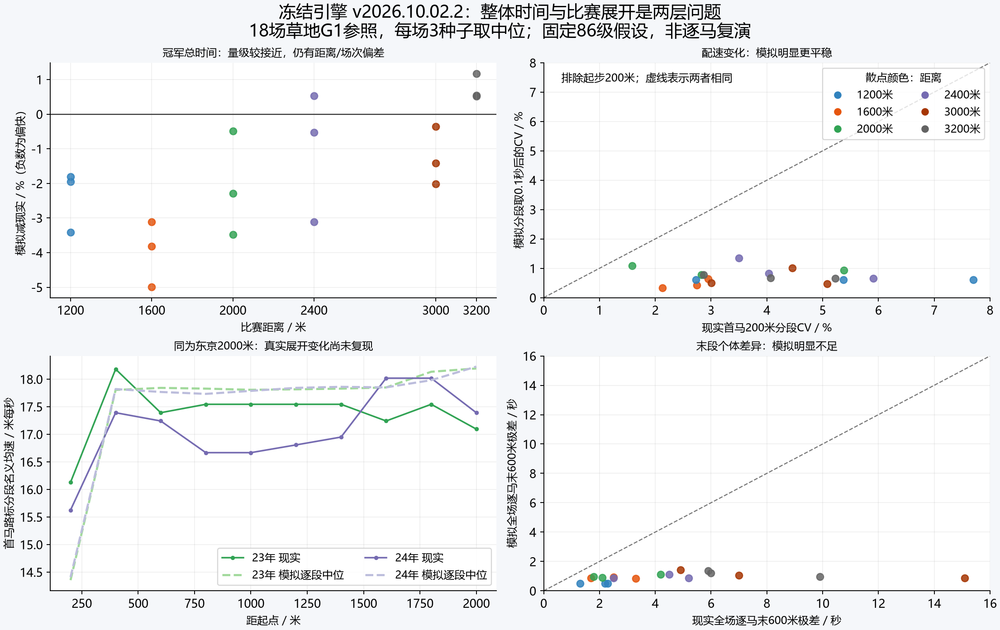

# 当前比赛引擎现实差距评估 · 2026-10-02

冻结提交582ce90，v2026.10.02.2，引擎SHA-256：`9b2cd208dd8d2e8415452d973a1bf76549222272accf1372bb616af14a2eeb8e`。本轮只测量与诊断，没有调整比赛参数或修改引擎。

**结论：冠军总时间和冠亚秒差已达到相近量级，但比赛展开、马群分布、逐马末段分化与位置变化仍未拟合。另确认一条交通结算导致瞬时清零速度的物理缺陷。不能把冠军时间近似解读为整个比赛系统已贴近现实。**

现实参照18场2023–2025 JRA草地G1：293次实际出走、289次完赛。主评估包括432场独立随机流合成矩阵，以及按真实出马数的54次G1档位对照。另保留432+108次旧随机口径复核，共1026场正式模拟。24场工具探针不纳入正式统计。

生成与比赛复用随机序列会耦合强马位置和闸位，因此主评估使用分离的伪随机流。旧结果保留作敏感性，不当独立样本。现实18场也是已查看参照，不再称新留出。每场三次试算取中位，再以18场为统计单位。

## 总时间、均速与冠军末600米

固定86级、优秀骑手、零初始疲劳、50斗志；全场使用真实冠军负重、假设480kg马体重，A栏代理、静风。真实阵容能力/策略/状态没有被逐马反推。以下数值说明量级是否接近，不等于同场复演。每距真实3场、模拟9次。

| 距离 | 真实冠军时间中位/s | 模拟/s | 配对赛时相对差中位 | 真实→模拟名义均速/m/s | 真实→模拟冠军末600/s |
|---|---:|---:|---:|---:|---:|
| 1200 | 67.00 | 65.69 | -1.96% | 17.91→18.27 | 34.20→31.59 |
| 1600 | 92.30 | 88.07 | -3.81% | 17.33→18.17 | 33.40→31.79 |
| 2000 | 117.30 | 114.62 | -2.29% | 17.05→17.45 | 32.50→33.08 |
| 2400 | 141.80 | 141.04 | -0.53% | 16.93→17.02 | 33.20→34.12 |
| 3000 | 184.00 | 180.50 | -1.42% | 16.30→16.62 | 35.00→35.39 |
| 3200 | 194.20 | 195.21 | 0.54% | 16.48→16.39 | 35.00→35.76 |

均速是距离÷时间，与赛时不是两项独立证据。不同年度场地条件、阵容和展开并未复刻；相对差按同场逐对计算，再取中位，不能用两列中位之比代替。

18场冠军总时间绝对相对误差中位1.883%，最大4.993%；冠军末600绝对相对误差中位2.724%，最大8.442%。首马前600最大误差11.636%，仍超出旧10%宽松门槛。达到宽松总时间门槛不等于逐段或整个系统拟合。

## 群体差距与速度形状

| 指标（每场统计后取中位） | 现实 | 当前模拟 |
|---|---:|---:|
| 冠亚完赛时间差/s | 0.200 | 0.249 |
| 冠亚名义马身差 | 1.25 | 1.83 |
| 首末完赛时间差/s | 3.05 | 4.24 |
| 冠军后1秒内完赛者占比/% | 61.1 | 25.1 |
| 冠军后2秒内完赛者占比/% | 87.6 | 50.2 |
| 全场逐马末600极差/s | 3.75 | 0.92 |
| 排除起步200米后的首马分段CV/%（同为0.1s） | 3.77 | 0.66 |
| 首马起步200米/s | 12.55 | 13.96 |
| 首马最快200米/s | 11.00 | 11.07 |
| 最后200米比前200米多用时/s | 0.350 | -0.062 |
| 首马末600减前600/s | -0.60 | -2.83 |
| 冠军与第5名名义均速差/m/s | 0.074 | 0.152 |

冠亚马身的现实中位/P90为1.25/2.8，来自完整18场排序；6场鼻/头/颈小着差没有强行数值换算。模拟用冠军过线时空间差÷2.4m，和官方照片终点着差仍有测量差异，完赛秒差是补充比较。首末差仅比较完赛者，不把中止当无限大差距。

各场全场最高瞬时速度的范围为17.49–19.41m/s。现实没有这18场逐马GPS峰速，不能据此宣布峰速拟合。2024短途最快首马200米9.9s（约20.2m/s）仅是局部速度量级/峰速下界参照，绝非同口径瞬时峰值。



## 各跑法/位置在各距离的出走胜率

下表首先给游戏本身的观察跑法：80米至八成距离的决策时平均相对名次分类。每距离每规模24场、等级70、默认生成状态，草地/回转适性匹配。胜率分母是该类别实际出走次数，括号为胜场/出走。它是事后分类统计，不是给某个跑法标签的因果胜率。

### 8匹默认生成阵容

| 距离 | 逃 | 先 | 差 | 追 |
|---|---:|---:|---:|---:|
| 1200 | 87.5% (21/24) | 4.6% (3/65) | 0.0% (0/54) | 0.0% (0/49) |
| 1600 | 64.0% (16/25) | 14.5% (8/55) | 0.0% (0/66) | 0.0% (0/46) |
| 2000 | 45.7% (16/35) | 11.8% (6/51) | 1.9% (1/54) | 1.9% (1/52) |
| 2400 | 53.6% (15/28) | 17.0% (9/53) | 0.0% (0/62) | 0.0% (0/49) |
| 3000 | 50.0% (14/28) | 13.8% (8/58) | 3.5% (2/57) | 0.0% (0/49) |
| 3200 | 55.2% (16/29) | 14.0% (8/57) | 0.0% (0/58) | 0.0% (0/48) |

### 16匹默认生成阵容

| 距离 | 逃 | 先 | 差 | 追 |
|---|---:|---:|---:|---:|
| 1200 | 37.5% (24/64) | 0.0% (0/107) | 0.0% (0/116) | 0.0% (0/97) |
| 1600 | 36.4% (24/66) | 0.0% (0/105) | 0.0% (0/118) | 0.0% (0/95) |
| 2000 | 30.3% (20/66) | 3.9% (4/103) | 0.0% (0/116) | 0.0% (0/99) |
| 2400 | 33.8% (23/68) | 1.0% (1/102) | 0.0% (0/117) | 0.0% (0/97) |
| 3000 | 34.4% (21/61) | 2.8% (3/109) | 0.0% (0/113) | 0.0% (0/101) |
| 3200 | 32.8% (20/61) | 3.8% (4/104) | 0.0% (0/114) | 0.0% (0/105) |

JSON另外保存赛前标签与终直入口位置代理两种口径、冠军构成及按整场重采样的95%区间；不能把“出走胜率”和“冠军构成”混用。零胜组的经验重采样区间可能退化为0，不代表理论胜率为0；仅24场的结果不能当精确概率。

### 与现实可近似比较的末弯位置代理

统一规则：名次1=逃；2..ceil(N×0.375)=先；其后至ceil(N×0.625)=差；剩余=追。现实为JRA末弯报出名次，模拟为领跑者进入终直时全场排名。JRA并列组保留名次范围，分类边界不确定性见来源JSON。因此这是近似位置比较，并非官方四跑法。每距现实仅3场，不能作为全JRA精确胜率目标。

| 距离 | 现实逃/先/差/追出走胜率 | 模拟逃/先/差/追出走胜率 |
|---|---|---|
| 1200 | 0.0% (0/3) / 16.7% (3/18) / 0.0% (0/11) / 0.0% (0/16) | 100.0% (9/9) / 0.0% (0/45) / 0.0% (0/36) / 0.0% (0/54) |
| 1600 | 0.0% (0/3) / 10.5% (2/19) / 5.9% (1/17) / 0.0% (0/15) | 55.6% (5/9) / 7.4% (4/54) / 0.0% (0/45) / 0.0% (0/54) |
| 2000 | 0.0% (0/3) / 5.9% (1/17) / 12.5% (1/8) / 8.3% (1/12) | 22.2% (2/9) / 16.7% (7/42) / 0.0% (0/27) / 0.0% (0/42) |
| 2400 | 0.0% (0/3) / 5.3% (1/19) / 15.4% (2/13) / 0.0% (0/13) | 44.4% (4/9) / 9.8% (5/51) / 0.0% (0/36) / 0.0% (0/51) |
| 3000 | 0.0% (0/3) / 16.7% (3/18) / 0.0% (0/14) / 0.0% (0/18) | 55.6% (5/9) / 7.4% (4/54) / 0.0% (0/42) / 0.0% (0/54) |
| 3200 | 0.0% (0/3) / 15.0% (3/20) / 0.0% (0/10) / 0.0% (0/14) | 33.3% (3/9) / 11.8% (6/51) / 0.0% (0/36) / 0.0% (0/51) |

18场现实冠军末弯代理构成0/13/4/1；54次模拟构成为28/26/0/0（逃/先/差/追）。真实样本小、比赛间相关、并行名次和采样时刻有差异，仍应将前位保持作为重点诊断信号，不能将某个固定胜率设成引擎配额。

## 固定场地与能力向量对照

两个16匹平坦抽象场地组各72场。同一批马跨距离复用，健康/普通骑手/固定负重；统一能力组仅将全部属性改为70，保留原行为与计划。此干预同时改变属性均值及离散，不能称只消除能力方差。

| 组别 | 冠亚马身中位/P90 | 首末马身中位 | 半程首位最终胜率 | 终直入口首位最终胜率 | 观察跑法冠军构成逃/先/差/追 |
|---|---:|---:|---:|---:|---|
| healthy-flat | 3.70/12.97 | 39.53 | 63.9% | 62.5% | 59/13/0/0 |
| equal-ability-flat | 0.70/1.20 | 30.37 | 16.7% | 16.7% | 70/2/0/0 |

默认8/16匹来自不同生成阵容，规模比较含阵容变化，不能当纯交通密度实验。能力统一组保留闸位、随机观察、不同性格/风险及走位；若仍有前后差距，只能排除“能力差异是唯一原因”，不能据此锁定一个机制。

## 已确认的运动—交通接口缺陷

正常运动先以3.5m/s²限制制动，但末尾的身体间距纠正直接重写位置和速度（`sim.js:1189–1196`），没有遵守此限制。横移预检各自对照邻马旧横坐标，末尾检查双方新横坐标；双方相向移动可以分别通过预检，却在末结算互相侵入安全间距。这时后马可被直接停住。

| 正式矩阵组 | 场数/马次 | 观察到低于−50m/s²的场数/马次 | 最差采样减速度/m/s² |
|---|---:|---:|---:|
| native-official | 288/3456 | 52/116 | -1096.2 |
| healthy-flat | 72/1152 | 29/106 | -1078.1 |
| equal-ability-flat | 72/1152 | 22/52 | -1051.1 |

−50仅用于描述极端不连续事件，并非新增现实合格线。矩阵每1/30秒读取最后一个内部步，可能漏掉其他内部步的事件；上述场数/马次不是事件总次数。

- healthy-flat：生成种子3198315393、比赛种子546640440，h7在48.000000秒、赛程768.521/1200米处，17.968558→0.000000m/s，用时1/60秒（-1078.113m/s²）。原运动提案是17.950038m/s，随后交通纠正夹低速度。此时尚未完赛。
- equal-ability-flat：生成种子3198943767、比赛种子547060654，h6在66.066667秒、赛程1063.810/1200米处，17.518462→0.000000m/s，用时1/60秒（-1051.108m/s²）。原运动提案是17.508708m/s，随后交通纠正夹低速度。此时尚未完赛。

两个复现只在冻结源代码的内存副本加观测回调，保留原1/30外步长、随机调用与全部逐马完赛时间；记录每个内部1/60步。复现与正式矩阵逐马时间及外层采样减速度完全一致，因此排除了观测改变比赛和终点截断的解释。

**已确认的是同步横移检查与速度纠正不一致；尚未确认的是它对马群拉散、前位优势和差追零胜各占多大贡献。** 当前也没有对应身体接触、摔倒或骑手拉停状态解释这次突变。做功/储备账通过并不能证明制动与接触运动合理。

## 系统层面的解释边界

把输出差异与代码机制清单分开。以下是待识别的机制组合，不是已证明的单一原因：

- 速度曲线过平、早期位置保持：马自身没有随竞争/受阻变化的抢口、兴奋、抗拒状态；骑手主要围绕单个余程目标配速；比赛节奏由局部预算与抢位形成。需一起核对马自身行为、战术互动、真实坡弯及能力分布，而非只改发动阈值。
- 末600差异不足或后方难反超：耐力同时决定有氧与短储备，速度同时决定上限与经济性，多数供能/疲劳参数全马共用；未来疲劳预测冻结当前值。需检查个体能力联合分布、真实参赛选择、运动状态演化与出力策略，不能只提高后方速度。
- 特定距离/赛段偏差：两直两圆弯与文字高程代理，缺少真实引入线、变曲率、移栏和地面空间差异；应定位实际发走位置与坡弯前后残差，不能给该距离加一个补偿倍率。
- 大头数差距/走位：已有身体约束、横移与绕行，遮挡仍是二元范围规则，通道预测短；入口位置优势也可能是较快马早已领先。需要匹配同能力/气性、不同交通布置和真实通过位置，才能区分交通和策略。
- 伤病/失足/中止：现实来源4次中止全部保留；当前DNF只有600秒工程超时，没有对应竞技事件。此缺失影响异常尾部，不应拿常态耗能去模拟事故。

同样，步态/热状态/水分/蹄地接触目前没有独立状态，但仅凭总时间和分段不能识别它们各自的重要性。应优先解释本轮观察到的速度形状和位置变化，再决定增加哪一层机制。

## 从系统着手的下一轮工作

1. 先修复已复现的运动—交通不一致：同步预测邻马完整轨迹，约束横移与有限制动的可行性，明确无法避让时的接触/事件处理。用同一马群、种子和指令轨迹比较修复前后，不靠改变跑法倍率补偿；检查其实际改变了多少场内差距与位置转换。
2. 再识别比赛节奏如何生成：记录骑手目标速度、马实际响应、竞争抢位、受阻与储备演化。对照多阶段出力计划、动态马行为与当前单余程目标计划，确认过平速度曲线主要来自哪一层；不预设每个距离的固定发动点。
3. 随后识别个体分化：将有氧能力、短时储备/功率、经济性、疲劳耐受及恢复的联合分布与真实阵容选择联系起来。同马跨距离与多次出赛，检验后方追赶、末段差异和距离优势能否自然形成。
4. 对残差仍集中于特定地点的赛事补真实路线：实际发走引入线、弯曲率、坡段、移栏和地面差异。保持上述共同机制，避免增加每距离补偿系数。

后3项是识别顺序，不是本轮已证实的单一病因。现有18场均已查看；下一轮若据此改模型，须另选未用于设计/调参的赛事作外部检验，并扩展级别、泥地、场地状态和同马数据。

## 文件与复现

- [现实官方逐马来源与口径](current-engine-reality-sources-2026-10-02.md)
- [G1档位逐场时间/速度报告](current-real-timing-audit-2026-10-02.md)
- [系统机制清单与代码证据](current-engine-system-audit-2026-10-02.md)
- [交通制动逐内部步复现证据](current-engine-traffic-braking-audit-2026-10-02.json)
- [整合机器报告](current-engine-reality-assessment-2026-10-02.json)
- [独立随机流全部432场（gzip归档）](current-engine-population-audit-independent-2026-10-02.json.gz)

```powershell
node tests/current-engine-population-audit.js --seeds 24 --workers 2 --seed-policy independent --out docs/current-engine-population-audit-independent-2026-10-02.json
node tests/current-real-timing-audit.js
node tests/current-engine-traffic-braking-audit.js
node tests/current-engine-reality-assessment.js
```

数值通过范围只在已有v7宽松赛时/末600/前600门槛下披露，不新增事后胜率或着差硬门槛。首马CV、位置代理、个体末600离散是结构诊断指标，没有假装它们已完成独立现实验证。
