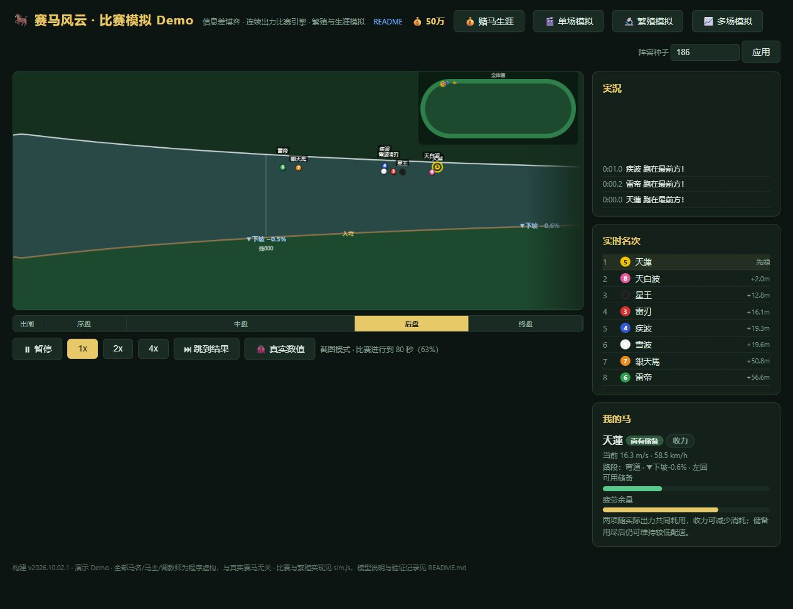

# 比赛系统现实拟合 · v2026.10.02.1

## 数据来源与验证边界

本轮使用 JRA 官方英文赛报中的 18 场 G1 草地赛，覆盖 1200、1600、2000、2400、3000、3200 米。数据保存在 [race-reality-reference.json](race-reality-reference.json)，采集日期为 2026-10-02。这是精英赛事速度量级的参照，不代表未胜利、条件赛或全部赛马的平均值，也不是逐马生理测量。

本轮数值对照固定 8 匹出马，真实样本多数为 14 至 18 匹，交通密度和获胜者选择分布不一致。真实库的 `fieldSize` 保留实际出马数；现阶段赛时残差是规模不同的量级对照，不是同场阵容复演，也不能证明拥堵频率已拟合。

固定划分：2023、2024 年 12 场作为校准；2025 年 6 场作为留出。数值校准不得使用留出模拟残差调参；最终源代码冻结后再运行留出验证。不能把合并后的 18 场平均值当成独立验证。

`winner.finishTime` 是冠军完赛时间，`winner.final600` 是同一冠军的最后 600 米。`raceSectionals200m`、`first600`、`first1000`、`raceFinal600` 是各路标首匹马通过的分段；途中领头马可以更换，不能把比赛末三段当成冠军末段。2023 年日本杯的冠军末段为 33.5 秒，首马路标末段合计为 36.5 秒，正好说明口径差异。

赛报的 Good to Firm、Good、Yielding、Soft 分别记录为 良、稍重、重、不良，并保留原始英文；这些是场地分类，不是测量出的阻力系数。本库只有 良、稍重的 G1 草地样本，不能验证泥地、重、不良的耗能系数。赛报没有稳定给出 A/B/C/D 移栏和逐段风速，模拟默认 A 栏、静风；负重有来源记录，马体重未被推测补齐。

| 分组 | 日期 | 赛事 | 场地/距离 | 冠军用时/末600米 | 官方来源 |
|---|---|---|---|---|---|
| 校准 | 2023-10-01 | Sprinters Stakes | 中山 1200 | 68.0 / 34.5 秒 | [赛报](https://japanracing.jp/_news2023/231001.html) |
| 校准 | 2023-06-04 | Yasuda Kinen | 东京 1600 | 91.4 / 33.1 秒 | [赛报](https://japanracing.jp/_news2023/230604.html) |
| 校准 | 2023-10-29 | Tenno Sho (Autumn) | 东京 2000 | 115.2 / 34.2 秒 | [赛报](https://japanracing.jp/_news2023/231029.html) |
| 校准 | 2023-11-26 | Japan Cup | 东京 2400 | 141.8 / 33.5 秒 | [赛报](https://japanracing.jp/en/japancup/news_results/news2023/231126.html) |
| 校准 | 2023-10-22 | Kikuka Sho | 京都 3000 | 183.1 / 34.6 秒 | [赛报](https://japanracing.jp/_news2023/231022.html) |
| 校准 | 2023-04-30 | Tenno Sho (Spring) | 京都 3200 | 196.1 / 34.9 秒 | [赛报](https://japanracing.jp/_news2023/230430.html) |
| 校准 | 2024-09-29 | Sprinters Stakes | 中山 1200 | 67.0 / 34.2 秒 | [赛报](https://japanracing.jp/_news2024/240929.html) |
| 校准 | 2024-06-02 | Yasuda Kinen | 东京 1600 | 92.3 / 33.4 秒 | [赛报](https://japanracing.jp/_news2024/240602.html) |
| 校准 | 2024-10-27 | Tenno Sho (Autumn) | 东京 2000 | 117.3 / 32.5 秒 | [赛报](https://japanracing.jp/_news2024/241027.html) |
| 校准 | 2024-11-24 | Japan Cup | 东京 2400 | 145.5 / 32.7 秒 | [赛报](https://japanracing.jp/en/japancup/news_results/news2024/241124-02.html) |
| 校准 | 2024-10-20 | Kikuka Sho | 京都 3000 | 184.1 / 35.6 秒 | [赛报](https://japanracing.jp/_news2024/241020.html) |
| 校准 | 2024-04-28 | Tenno Sho (Spring) | 京都 3200 | 194.2 / 35.0 秒 | [赛报](https://japanracing.jp/_news2024/240428.html) |
| 留出 | 2025-09-28 | Sprinters Stakes | 中山 1200 | 66.9 / 33.0 秒 | [赛报](https://japanracing.jp/_news2025/250928.html) |
| 留出 | 2025-06-08 | Yasuda Kinen | 东京 1600 | 92.7 / 34.2 秒 | [赛报](https://japanracing.jp/_news2025/250608.html) |
| 留出 | 2025-11-02 | Tenno Sho (Autumn) | 东京 2000 | 118.6 / 32.3 秒 | [赛报](https://japanracing.jp/_news2025/251102.html) |
| 留出 | 2025-11-30 | Japan Cup | 东京 2400 | 140.3 / 33.2 秒 | [赛报](https://japanracing.jp/en/japancup/news_results/news2025/251130-02.html) |
| 留出 | 2025-10-26 | Kikuka Sho | 京都 3000 | 184.0 / 35.0 秒 | [赛报](https://japanracing.jp/_news2025/251026.html) |
| 留出 | 2025-05-04 | Tenno Sho (Spring) | 京都 3200 | 194.0 / 35.3 秒 | [赛报](https://japanracing.jp/_news2025/250504.html) |

## 场地模型

比赛距离改变起跑偏移与圈数，不改变同一布局的周长、弯道半径和坡段。命名场地按草地/泥地选择独立尺寸；草地内外圈按距离选择。界面使用同一几何绘制、标注和计费，正式场地采用官方回转方向，起伏优先使用场地高程，抽象对照场地仍可自选起伏与方向。

| 场地 | 草地 A 栏周长（内/外） | 终点直道（内/外） | 全程高差（内/外） | 泥地周长/直道/高差 | 来源 |
|---|---|---|---|---|---|
| 东京 | 2083.1m | 525.9m | 2.7m | 1899 / 501.6 / 2.5m | [JRA](https://www.jra.go.jp/facilities/race/tokyo/course/index.html) |
| 中山 | 1667.1 / 1839.7m | 310m | 5.3m | 1493 / 308 / 4.5m | [JRA](https://www.jra.go.jp/facilities/race/nakayama/course/index.html) |
| 京都 | 1782.8 / 1894.3m | 328.4 / 403.7m | 3.1 / 4.3m | 1607.6 / 329.1 / 3.0m | [JRA](https://www.jra.go.jp/facilities/race/kyoto/course/index.html) |
| 阪神 | 1689 / 2089m | 356.5 / 473.6m | 1.9 / 2.4m | 1517.6 / 352.7 / 1.6m | [JRA](https://www.jra.go.jp/facilities/race/hanshin/course/index.html) |
| 新潟 | 1623 / 2223m | 358.7 / 658.7m | 0.8 / 2.2m | 1472.5 / 353.9 / 0.6m | [JRA](https://www.jra.go.jp/facilities/race/niigata/course/index.html) |

几何是受这些官方尺寸约束的两直两弯代理，统一可用宽度 20 米；不复刻真实跑道平面形状、螺旋弯、引入线、移栏、宽度变化、混合内外圈及草地起跑后转泥地。东京 3200、中山 2400 等未列入官方发走距离的组合允许沙盒运行，但标记 `distanceSupported=false`。中山/阪神 3200 的混合内外圈明确标记为单圈代理。

高程使用闭合分段线性曲线，每圈上升与下降的代数和为零。东京终点直道的 160 米/2 米坡、中山残180至70米的 110 米/2.2 米坡、阪神终点前 1.8 米坡，以及京都第三弯上升后下降、新潟外圈末弯下坡的结构按官方说明约束；其他拐点位置属于近似，不是实测逐米高程。坡度导数进入做功计算，不能只给“急坂场地”一个全程扣速倍率。

## 跑法、骑乘与生成

四种跑法系数全阶段均为 1，骑手等级速度奖励与动作额外速度/耗能倍率均为 0/1 的兼容接口。物理与骑手决策不读取 `style`；它只用于历史、显示和公开市场预测。能力、性格和骑乘计划独立：新马使用生成种子取样并保存性格，旧马缺字段时按稳定身份补齐，不消费比赛随机数。生涯报名和马群入场保留性格、计划与负重。

骑手只感知附近马匹，并按等级间隔重新观察，存在估计误差与有限响应速度。前位意图必须支付可负担的抢位加速成本；跟跑需要比较短期空气阻力收益与追回丢失距离的能量，不能为了遮挡一味压低配速。余程预算反复积分实际路线的功率与供能，不把“进入某阶段”当成发动开关，发力可撤回并重新发动。空档与横移受身体尺寸、横移速度、外绕弧长和通道限制。

赛后跑法根据 80 米至八成距离期间观察到的名次分类；数值报告另披露进入终点直道时的实际排名分类。这两种口径不能混用，也不设置四种跑法各占四分之一的冠军配额。新版生成阵容的能力分布与此前按跑法选择模板的阵容不同；与上一引擎比较时仍固定同一批输入马，避免把生成变化误报成引擎效应。

## 运动与供能

模型使用机械等价的比功率 W/kg、储备 J/kg。功率由推进阻力、空气阻力、弯道负担、坡度势能和加速动能共同构成；负重按实际负重相对 57kg 基准修正总质量。积分核对实际速度、加速度与可用功率，短时储备不能先透支再截为零。减速可由已有动能支付阻力，但不会把动能直接回充储备。横移消耗实际行程，弯道外线走更长弧长。

连续有氧供能具有建立过程，短时储备支付超出供能的出力，毅力表示并行的疲劳耐受。收力时只有明显低于供能的做功才允许有限储备恢复。跟跑只降低空气阻力项；正风速表示终点直道逆风，其他路段按行进朝向投影，同一圈不会处处逆风。

结构参考 [Mercier 与 Aftalion (2020)](https://journals.plos.org/plosone/article?id=10.1371/journal.pone.0235024) 的运动、供能和配速耦合思路；其个别赛马拟合参数不能当作全部马匹的普适生理常数。跟跑机制参考 [Spence 等 (2012)](https://pmc.ncbi.nlm.nih.gov/articles/PMC3391435/) 的赛事跟踪研究。当前数值是游戏模型的机械等价参数，不是直接测量的摄氧量、乳酸或代谢能量。

最终审查还修正了跨坡段接点的供能漏洞：限制出力与记账统一使用实际候选路径，坡功率按实际高差/时间计算。这样不会用坡前位置限制出力、再用坡后位置记账，也不会让外道因弧长较长而重复支付同一高差。逐马累计总做功、有氧实际支付、储备支付、有限恢复与未支付功分别记录，验证总功账和储备账，不只检查储备是否被截为零。

| 参数 | 当前值 | 含义与来源边界 |
|---|---|---|
| 推进阻力常数 | 0.250 | 功率主项为常数×速度平方；全局赛时校准 |
| 70 点持续供能 | 50 W/kg | 耐力每点加 0.24；与公开赛时量级共同校准 |
| 储备容量 | 耐力×35 J/kg | 独立短时容量，不代表固定可跑距离 |
| 最大储备出力 | 75 W/kg | 受剩余容量、步长与末段渐变限制；游戏假设 |
| 供能建立时间常数 | 10 秒 | 热身后起始供能为45%；初始比例仍是待测假设 |
| 起步/高速加速上限 | 4.6/2.2 m/s² 参考值 | 随出闸、爆发、响应与实际可用功率约束 |
| 横移速度上限 | 0.8 m/s | 路线与画面共用；待逐马轨迹标定 |
| 尾流空气阻力项 | 有遮挡时×0.72 | 只作用于空气项；距离范围12米，均为待标定参数 |
| 恢复上限 | 2 J/kg/s | 仅用供能盈余的12%，低于90%供能时发生 |

力量对烂地推进成本和弯道侧向限制起作用；草地良/稍重/重/不良阻力倍率为 1/1.035/1.08/1.15，泥地为 1/0.995/1.02/1.075。泥地轻微湿润与泥泞分开，但这些倍率没有本轮实赛样本支持，只接受方向与有限状态检验。泥草不适性、抗疲劳、身体碰撞耗散与转向侧向功仍是简化，不能据此宣称已完成生物力学复刻。

## 参数选择与核验

`tests/fit-race-physiology.js` 只对 2023/2024 年训练组运行 12 组预先列出的全局候选参数。固定名义 G1 能力86、八匹出马、优秀骑手、零初始疲劳；同距离共用马群种子，没有按赛事反推隐藏能力。目标为总时间相对残差平方加上各0.25权重的冠军末600米、首马前600米相对残差平方。最优候选 `r250-e35-a50` 的所有参数与残差保存在 [训练拟合报告](race-physiology-fit-v2026.10.02.1.json)。

训练选择时每参照只有一次试算，生成性格和策略随后完善，因此训练报告的源码指纹属于开发快照。最终验收重跑训练参照并独立检查 2025 留出，使用最终源码指纹，不能把选参报告误记为最终验收。G1能力86属于统一游戏档位假设，赛时拟合不能识别个体生理，也不能约束全部赛事等级。

`tests/course-reality.js` 检查 17 个草地/泥地布局的官方尺寸、闭合几何、高程积分、连续弯道、外线多走距离，以及 18 场来源与分段口径。测试不能证明近似跑道平面已经复刻现实。

数值残差、源代码冻结与最终留出结果由本轮数值报告记录，不能从功能测试通过推导现实拟合通过。


## 骑手策略开发阶段的配对比较

在最终源码冻结前，使用校准种子完成 48 对场次（6 个距离 × 2 个方向 × 4 个种子，共 96 场；8 匹生成马，等级70，标准草地、良、平坦）。每对阵容、比赛 RNG、物理参数和场地完全相同，只替换骑手策略。旧策略来自本轮开发工作区在“完整滚动预算与跟跑机会成本”改进前的 runAI 快照，不是上一发布版 c7dda5d。

| 指标 | 旧策略 | 改进策略 |
|---|---:|---:|
| 1–2名着差中位数 | 4.67马身 | 2.15马身 |
| 1–2名着差P90 | 10.22马身 | 6.29马身 |
| 尾马差中位数 | 26.42马身 | 20.41马身 |
| 半程首位最终获胜比例 | 62.5% | 45.8% |
| 终直入口首位最终获胜比例 | 62.5% | 56.3% |
| 各场完赛储备中位数的中位数 | 3.16% | 3.16% |

全部96场完成。终直入口第4位获胜由1场变为2场，第5–8位仍无胜场；小样本不足以确认全部后位竞争已经形成。改进取消耐心对巡航速度的直接扣减，跟跑需比较遮挡节省与追回丢失距离的出力，并修复沿用旧慢速指令评估超车通道的问题。没有设置跑法胜率配额，也没有使用留出种子。

这是开发阶段的因果检查，不能作为最终验收或真实赛事拟合结果。[开发报告](rider-policy-ab-v7-development.json)记录当时的新旧源码SHA256；其中的哈希不是最终发布引擎的哈希。旧策略文本保存在 tests/fixtures/rider-policy-before-v7.txt，可运行 node tests/rider-policy-ab.js [输出JSON路径]，在当前物理下重测两种策略；后续物理参数变更后，重跑数值允许与这份历史报告不同。

## 冻结后的最终验收

规范化源码 SHA-256 为 `331bee1f537dcc64d41bfde95552c7458884dedddade12b6b36ece4db70b7889`，UTF-8 将 CRLF 统一为 LF、保留 BOM 后计算。最终验证前后指纹一致，参数与训练选定候选一致。首次正式留出运行后，没有使用留出结果修改参数、替换种子或放宽门槛。

```powershell
node tests/race-calibration-v7.js --per-cell 2 --expect-hash 331bee1f537dcc64d41bfde95552c7458884dedddade12b6b36ece4db70b7889 --json docs/race-calibration-v2026.10.02.1.json
```

[完整JSON](race-calibration-v2026.10.02.1.json)包含576场主矩阵、144组与c7dda5d同输入对照、8场环境压力、受控机制检验、18场官方参照各3次试算（54次）。主矩阵为6距离×2方向×3布局×2路面×2阵容×2种子组×2重复；生成阵容匹配路面和方向适性，保留能力、疲劳与骑手差异。真实参照另用统一86级、优秀骑手与零初始疲劳，不能与70级主矩阵时间直接比较。

24项工程检查全部通过：所有主矩阵八匹完赛、速度/加速度/横移有限、供能与储备账相符，8个环境压力场景正常。主矩阵最大累计功账误差为2.06×10⁻¹⁰ J/kg，最大未支付功为3.84×10⁻¹³ J/kg，均低于1×10⁻⁵门槛；54次真实参照试算也完整且守恒。改跑法标签后逐马时间、余力、路线、名次差均为零，相同生成种子不同标签的能力与性格也完全相同。

| 种子组/阵容（各144场） | 冠亚差中位 | 冠亚差P90 | 首尾差中位 | 首尾差P90 | 头部着差门槛 |
|---|---:|---:|---:|---:|---|
| 校准/生成 | 2.594 | 9.448 | 19.166 | 30.933 | 通过 |
| 留出/生成 | 2.327 | 8.784 | 20.093 | 31.694 | 通过 |
| 校准/同源 | 0.797 | 1.595 | 12.758 | 15.938 | 对照披露 |
| 留出/同源 | 0.849 | 1.643 | 12.670 | 14.799 | 对照披露 |

着差单位为马身，门槛预先定义为两个生成大组分别中位≤3、P90≤10。同输入旧新比较中，冠亚差中位3.573→2.594、P90 9.354→9.448，尾差中位37.521→19.166、P90 52.367→30.933。尾部明显收敛，但头部P90略升，不能宣称全部指标都改善。校准组长直道、泥地子组P90分别10.050、10.590，留出子组均≤10；原门槛不是事后增设的每子组门槛，不能用整体通过掩盖子组偏差。

| 同输入70级对照，每距24组 | 冠军时间旧→新（秒，中位） | 新冠军末600米（秒，中位） |
|---|---:|---:|
| 1200 | 70.442→68.477 | 32.77 |
| 1600 | 94.074→96.049 | 34.89 |
| 2000 | 117.947→123.956 | 36.26 |
| 2400 | 142.319→152.596 | 37.47 |
| 3000 | 178.657→194.797 | 38.71 |
| 3200 | 189.975→208.385 | 38.86 |

此前不同距离的冠军末600米接近32.7–33.1秒；当前随长程负担与疲劳变慢。该结果说明储备分配开始产生距离相关后果，不证明游戏70级对应哪一级现实比赛。半程首位最终获胜为校准50%、留出56.25%，终直入口首位最终获胜分别90/144、89/144。位置类别为事后观测，仍有前位优势，后位竞争也尚未对大头数真实阵容进行验证。

## 真实参照残差与未达项

各参照的预测为3次试算中位，误差统计为每赛事绝对相对误差；门槛按最大值判断，不能用平均误差代替。

| 分组 | 指标 | 绝对误差中位 | 最大 | 原门槛 | 结果 |
|---|---|---:|---:|---:|---|
| 2023/24校准 | 冠军总时间 | 1.877% | 4.649% | 5% | 通过 |
| 2023/24校准 | 同冠军末600 | 3.685% | 8.679% | 10% | 通过 |
| 2023/24校准 | 首马前600 | 3.310% | 10.352% | 10% | 未达 |
| 2025留出 | 冠军总时间 | 1.263% | 5.809% | 5% | 未达 |
| 2025留出 | 同冠军末600 | 2.968% | 7.153% | 10% | 通过 |
| 2025留出 | 首马前600 | 3.815% | 6.675% | 10% | 通过 |

| 2025留出赛事/距离 | 真实总时 | 模拟总时 | 总时相对误差 | 真实→模拟冠军末600 |
|---|---:|---:|---:|---:|
| Sprinters/1200 | 66.900 | 65.511 | −2.077% | 33.0→31.510 |
| Yasuda/1600 | 92.700 | 87.315 | −5.809% | 34.2→31.754 |
| Tenno秋/2000 | 118.600 | 113.412 | −4.375% | 32.3→32.775 |
| Japan Cup/2400 | 140.300 | 139.714 | −0.418% | 33.2→34.130 |
| Kikuka/3000 | 184.000 | 184.443 | +0.241% | 35.0→36.097 |
| Tenno春/3200 | 194.000 | 193.128 | −0.450% | 35.3→36.043 |

两项失败保留原始结果：2023天皇赏春首600米38.623秒、真实35.0秒，偏慢10.352%；2025安田纪念总时87.315秒、真实92.7秒，偏快5.809%。报告为 `engineeringPassed:true`、`empiricalPassed:false`、`passed:false`，正式命令退出码1。当前实现与工程检验已完成，严格现实拟合尚未全部达标，不能称为完整复演现实比赛。

未来修正应先检查东京1600的速度能力映射、前段策略与实际发走路线，以及大头数交通与逐马分段，重新使用独立验证数据；不能依据这次留出误差再偷偷修改参数并继续把2025称作未见样本。湿地、泥地、不同班次、移栏、风况、伤病与步态耗能仍需要相应真实样本。

## 功能、机制与实机验收

- 物理20项、弯道骑手19项、骑手策略13项、能量方向7项通过。新增690以上官方坡接点与圈界空储备探针、外道势能对照、横移与真实碰撞的守恒回归；37,440功率反解点无非法状态。
- 15/30/60Hz验证的是外部调用频率一致性，均拆成内部60Hz；物理测试另比较60/120Hz实际积分，不能把相同内步长的重复调用当成独立步长收敛证据。
- 场地17布局/243断言与18个参照来源检查通过。40个镜头场景/600项通过；守恒修正后重跑6个官方/长短途场景90项仍通过。
- 市场87场、六类马券与漏洞、存档18项、生涯流程14组、页面诊断8组、冒烟20项和MC15项通过。真实生涯生成赛程→报名→存档刷新→比赛链路保留性格、计划、马体重与负重，旧缺字段赛程正常且确定性完赛。
- 页面/CLI30对逐场一致，额外200对汇总均为冠亚差中位1.6488、平均3.3289马身。此MC场景与平坦主矩阵口径不同，只核对同输入实现一致性。
- 功能回归执行快照 `bd429d06…` 与最终源只差市场说明注释；冻结后的正式数值与物理20项、策略13项、场地、页面冒烟/MC/马券回归使用最终 `331bee1f…`。

本轮取得真实浏览器验收：东京2000米官方方向、高程、骑乘计划编辑、完整赛果与回放正常；定格2000米标准布局80秒时确认全部圆点、地图与余力状态正常，控制台无错误。下图是本版本实际画面，并非历史截图。


