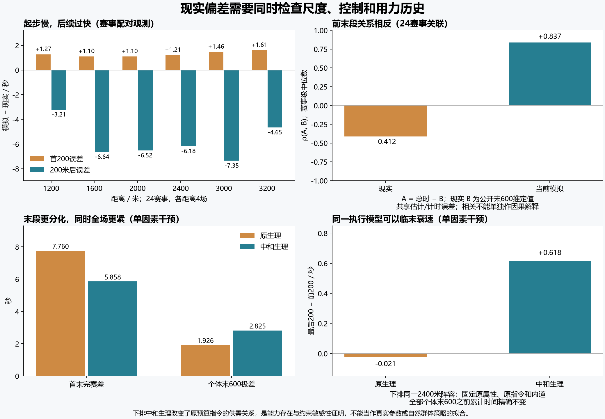

# 比赛引擎现实偏差根因诊断 v10
本轮诊断支持的方向是执行尺度、骑手控制问题、能力与用力历史的联合分布，以及观测选择共同影响偏差。已有物理与生理能产生末段分化、补偿和临末衰速；当前自然比赛样本没有充分激发这些能力。不能把七项残差分别交给七个补偿系数，也不能把全部问题归为缺少疲劳。
本轮只做诊断与可复现实验，生产引擎与系数未改，现实拟合仍未通过。完整机器报告见 [causal-realism-diagnosis-v10.json](causal-realism-diagnosis-v10.json)。

## 证据边界与检查范围
当前源 `51caabc1395b62a325f3048aa923994516310d8c69665f3fd17b89978615b82a`；旧完整数值矩阵源 `3b837b46bf03ed86a19fdbe0ff83a03bb4fd2211ff9a4692b2f1a78e12f221ff`。旧 v8/v9 各270+18场保留原始归档；18场2023–2025为主参照，2022六场为额外参照，合计24场真实赛事。新增起步/预测/空气执行当前51caabc；新增90次群体/路线独马干预实际执行归档3b837b，并通过整份源文件逆补丁检验与当前物理/求解代码相同。旧矩阵与当前源的差异已在 [快照一致性证明](source-snapshot-equivalence-v9.json) 中分开验收，没有把旧数据改写为当前源码重跑。
新增144次起步、24次固定道整场、80次生理执行（含历史与插桩验证）、90次群体输入/独马路线执行、20次空气项执行，另有起步和空气各4次插桩验证，共366次执行。起步执行只到600米，不能称366场完整比赛。
另有阅读源码后构造的跟跑反例：最终记录2个初始化实例/22次预测查询，无引擎步进，无完整比赛，不计入366次执行。开发中止与查询复核另见专项，不冒充自然AI样本。
对照先在同马、同输入、同路线/指令下做差，再汇总。部分测试故意固定指令、去掉互动或固定外道，是机制识别工具，不能当现实可执行的骑手策略或新的群体均衡。矩阵中的官方马场状态已传入，不能声称所有官方赛事均被按良模拟；独马诊断另行固定良、无风。
真实与模拟是同赛事距离/路线/人数的对照，合成G1阵容没有逐匹重建真实能力、负重、距离筛选与习性。因此可确定内部因果和不足，尚不能精确计算每个真实残差有百分之几来自哪个因素。

## 各项指标与根因判别
以下是18个主参照赛事的赛事级中位数；模拟先取每赛事3个种子的中位数。完赛密度以有限完赛者为分母，取消和中止另列。

|指标|现实|当前|判别|
|---|---:|---:|---|
|首末完赛秒差|3.050 s|6.933 s|能力映射、原始阵容、路线与控制共同作用；前段和末段优势叠加，而非仅末段离散不足。|
|冠军后1秒内完赛者比例|61.11 %|12.55 %|与全程差距同源；要检查中心完赛密度和前末段补偿，不能仅压缩末段方差。|
|冠军后2秒内完赛者比例|87.61 %|21.76 %|与上项同源；记录精度干预不能解释差距。|
|全场个体末600米用时极差|3.750 s|1.767 s|诊断支持自然请求与供能约束没有充分激发末段历史分化；已有生理能够分化，真实贡献和参数仍未识别。|
|首马起步200米用时|12.550 s|13.799 s|加速/最高速度映射与中长程保守请求均有因果证据；供能建立并非当前主约束。|
|起步后领跑200米分段CV|3.77 %|0.54 %|恒定余程请求的控制问题、路线与领跑者选择共同作用；缺少对获胜和对手响应的明确规划。|
|最后200米减前200米|0.350 s|-0.040 s|需求仍低于衰减上限、预算渐放开、路线和耗尽时点共同作用；并非没有疲劳，现实也不总减速。|
|冠军全程标称均速|16.988 m/s|17.602 m/s|起步慢掩盖余程过快，需联合识别能力/耗能/控制；不能整体调快修起步。|
|最快领跑200米标称均速|18.182 m/s|18.201 m/s|总体中位数接近只是局部量级接近；持续高速的时长、距离分布和速度曲线仍失真。|
|冠亚军完赛秒差|0.200 s|0.339 s|优势跨段叠加和位置策略不足；秒差与裁判马身着差口径不同。|

“最快200米”中位数接近，和持续高速过久可以同时存在。冠军时间相对误差中位数3.25%、最大7.08%，仍未通过先前5%最大误差门槛；冠军末600米最大误差9.11%通过先前10%门槛，只代表这一粗验收量级，不能证明整体节奏正确。现实裁判着差不能机械等同于秒差乘速度/马长，详细马身类别与边界保留在旧报告。


图上排为样本观测，下排是一个2400米阵容的固定指令干预；不能把下排变化当作全场自然AI的已完成拟合。

## 起步慢、随后快：统一速度倍率无法同时解决
18场的首200配对误差中位数为 +1.233 s，200米到终点为 -5.590 s，总时间为 -4.483 s。全部18场起步偏慢、余程偏快、总时间偏快。每场恒等式总误差=首200误差+余程误差逐个成立；三个中位数本身不必相加。

|距离/米|首200误差/s|200米后误差/s|总时间误差/s|
|---:|---:|---:|---:|
|1200|1.269|-3.209|-1.937|
|1600|1.100|-6.638|-5.515|
|2000|1.095|-6.523|-5.564|
|2400|1.211|-6.176|-5.102|
|3000|1.463|-7.353|-5.648|
|3200|1.606|-4.652|-3.193|

此距离表含24场、每距离4场，场地和赛事等级共同变化，不能解释为距离的纯因果效应。200米后速度由领跑标志点到终点的包络时间求得，不是某一匹马的GPS速度。
起步同车道干预：加速上限+25%提前 0.464 s，最高速度+10%提前 0.616 s；无氧释放功率+25%改变 0.00000 s，氧输出完全建立仅提前 0.00546 s，响应时间−25%提前 0.05275 s。
正常AI相对同道最大请求首200，1200米额外 0.00064 s，2400米额外 0.984 s。短程多为执行加速/速度约束，长程还包含保守骑手请求。
这支持当前起步不能优先靠加供能修复，也不能仅凭首200就整体提高最高速度：后者可能加剧已经过快的余程，中长程若请求仍低于上限也可能没有直接效果；本轮未测自然全场maxV+10%的总效应。下一步必须联合识别起步曲线、持续速度与耗能。具体步态/推进力状态是否必须新增，需要连续速度轨迹区分，不由一个首200用时决定。详见 [起步与控制专项](causal-controller-start-v10.md)。

## 完赛场过散、末600却过齐：关键是差异如何跨段组合
设 T 为个体完赛时间，B 为该个体末600时间，A=T−B 为末600之前累计时间。现实B来自官方“推定上り3F”，A是由估计末段推导的前段代理，不是独立GPS或末600入口实测计时；未知的估计误差会影响关联与排名。Var(T)=Var(A)+Var(B)+2Cov(A,B)。不能仅看B极差，把它调大后期望T自然变紧。
24场按官方0.1秒口径，ρ(A,B)赛事中位数现实 -0.412，当前 0.837。现实样本多数体现前末段互相补偿；当前则前段快的个体末段仍快，差异叠加。3200米现实等子集可正相关，不能把负相关写成所有距离必须遵守的规则。
按公开推定末段推导，现实冠军同时拥有最短A只占 4.17%，当前为 73.61%；冠军末600最快为现实 41.67%、当前 63.89%。A在2400米是前1800，在3200米是前2600，不是所有距离的首600，也不是独立测量的入口先后。
这些是结果选择后的关联，A/B共享估计与计时误差；仅对模拟四舍五入不能识别现实推定值的未知误差。它们定位公开记录的形状差异，不能单独证明骑手或能力的因果贡献。新的输入干预才用于确认当前引擎能否生成补偿，后续应以独立逐匹追踪轨迹验证现实关系。
2400米受控阵容：保留原属性与原骑手指令，只把生理画像改为neutral，所有马A完全不变；尾差 7.760→5.858 s，B极差 1.926→2.825 s，ρ(A,B) 0.967→-0.337，最后两段差 -0.021→+0.618 s。
它同时出现“末段更分化、总场更紧、临末变慢”。因此物理实现并未禁止所需形状。因果结果是原生理画像×原预算指令改变晚段活动约束；neutral不是拟合答案，原指令按原画像形成，重新规划的全场结果尚未测量。
属性归一而锁住原生理和原指令，在这两个1200/2400案例只缩小尾差0.101/0.061秒；不能据此说属性没有总效应，因为旧指令保留了属性引起的策略差异。去掉人为强马+2也只使该马中位慢约0.765秒，插入原固定指令独马阵容后尾差、1/2秒密度、B极差的配对中位变化均为0。它不是目前整场数秒裂散的主要直接来源，群体重规划效应仍未测。
路线也有已测量贡献：保留原请求改走同内道，六距离尾差减少约0.70–1.87秒；1200明显，长程仍有较大残差。该干预同时改变真实弧长、曲率约束、到达坡段时间与支出反馈，不能全称为纯长度。外道真实成本应保留，应改的是合法路线选择与实测几何；直接去身体交通/遮挡几乎不减尾差，只排除了保留原指令时的净直接效应，原指令仍带着交通影响。
旧“等能力”和“健康阵容”对比有混杂：旧数据没有显式生理，迁移种子含初始属性；改属性同时改变576/576匹生理画像，单轴最大差1.733。因此此前包裹对比不能解释为纯属性离散贡献。
输入层还缺现实同等级与距离的参赛筛选/能力联合分布，而非简单缺几个独立随机生理轴。速度属性同时影响速度上限与经济性，画像还影响供能、储备与上限；这些映射如何联合塑造优势必须锁变量识别。详见 [群体、路线和标签专项](causal-population-paths-v10.md)。

## 节奏过平、末段不衰：控制需求与活动约束需一起检查
当前budgetSpeed搜索全余程共用的一个请求速度；finishPlan预测固定未来疲劳/当前车道的需求与供能。每次观察重算这个请求，再叠加局部跟跑、让行、换线、攻击。源码已有这些行为，但主要目标仍是自己的可行完赛时间，缺乏明确的位置价值、获胜效用和对手未来响应规划。
跟跑有更具体的预测不一致。AI用横差<2.5米认定候选尾流，物理做功则用半体宽之和+0.8米；体格70时后者为1.555米。比如前后差8米、横差1.8米，预算会提前假定最多44米遮挡，实际却没有折扣。44米是自身预测进度，12米是两马间距，不能把两个不同量直接比较；缺的是对齐、间距与对手运动的传播。
跟跑与追回各至多8秒，但canRegain以当前状态、catchV覆盖整个余程验可行性，既未传播先跟跑省能，也未在短时追回后返回预算。它可能过严拒绝，当前尚未执行这种拒绝的严格反事实。同时它会把超上限的catchV截断，却不检查追回距离。构造状态s=2200、储备800时，需要追回0.8米，catchV=19.017m/s而maxV=18.75；预测仍返回可行，即使瞬间达最高速度，在其2.684秒窗口也最多追回公式假定的0.083米。这个局部反例确认可达目标与检查不一致；自然AI可能先attack，不能声称已经发生跟跑或识别了全场频率。详见 [跟跑机会专项](causal-follow-opportunity-v10.md)。
已有碰撞和支付约束必须保留，需要逐段传播可行的跟跑→追回→回预算/让行→入位→推进动作，分别验能量可行与距离/位置目标可达。长期节能、位置价值及自然发生频率尚待记录，不能只扩大跟跑收益系数。
旧192匹个体CV中位数1.69%，比全场领跑CV高。新固定外道独马AI/同均值恒定请求的分段CV约2.92/2.95%，实际速度CV仅0.33%；外道弧长变化可以产生标称200米分段波动。不能说整个引擎绝对匀速，也不能用个体CV替代领跑CV。
新的中长程固定道AI样本，在200米后基本被请求速度限制，供能和最高速度没有成为最小项。上限随疲劳下降但仍高于主动请求，物理速度不会被迫下降；预算缩短余程逐渐放开请求，最后一段稍快。要检查谁在何时进入速度、功率、曲率、加速或阻挡约束，而非只看体力条下降。
同一匹70属性马2400米，末600都请求最大30m/s，中段14.5/16.5后末600为34.062/44.085秒。进入末600储备47.615%/0.0066%，最后200差+0.712/+0.008秒。早耗尽会在整段末600进入慢而平的供能平台，晚耗尽才在最后降速。这不是等总功历史或现实个体间极差对照，但证实生理历史有响应能力。
因此优先问题是自然竞争是否形成抢位、压迫、放松、再次发动与不同耗尽时机。已有racePlan的位置/风险/耐心和持续的attacking/passTarget/laneIntentT状态；不足在跨动作序列的评估，以及明确的获胜效用/附近对手未来响应规划。情绪、疼痛、步态、供氧多状态是后续候选，尚不能由这些数据证明都必须加。

## 预测与执行确实不一致，但不是全部根因
8个可行预算请求预测−实际余程为 -0.521 至 0.001 s；冻结未来guts后为 -0.069 至 0.001 s。预测冻结疲劳导致误差已确认，应该修复。
40→5米预测网格在可行预算请求的最大时间差 0.00370 s；仅冻结加速储备因子的本样本时间差均为0。二者不是此平坦固定路线样本的主误差，不代表坡段、交通、动态横移无影响。
不可行最大请求的预测时间只是需求轨迹，不是骑手承诺。最大28.25秒误差不能用来宣称正常AI误判28秒。修预测应先传播现有执行状态、限制与恢复，并做同状态续跑验证；本样本约0.5秒量级，不能承诺它独自修完约7秒尾差。详见 [预测—生理专项](causal-prediction-physiology-v10.md)。

## 空气节能、场地与力学：有值得识别的尺度和简化
当前无风平路18m/s稳态项：空气占总需求 4.47%，默认遮挡降低空气项28%，对应总需求节省 1.25%。尾流机制存在，不能说完全没节能。
同马固定请求且永久屏蔽空气、取消弯道费用/速度限制的理想诊断，默认屏蔽提前1200米0.388–0.551秒、2400米约1.019秒。若仅在18m/s保持总稳态需求、把空气相对份额重分到17%，屏蔽效应变为1200米0.707–1.814秒、2400米约3.79秒。其他速度的总需求也随之改变，且此永久屏蔽不是真实马群；这是相对份额敏感性，17%不是推荐系数。
追踪研究给空气功率约17%的粗估，基于特定迎风面积、阻力系数、速度和机械功率假设；游戏的等效耗能不能直接当真实代谢功率。应该分别识别空气、地面和其他成本，使跟跑效应在真实速度/暴露下成立。已有“移除互动独马”的净差很小也不能证明尾流没用，因为它同时去掉交通损失并保留原指令。参见 [Spence等2012原始研究](https://pmc.ncbi.nlm.nih.gov/articles/PMC3391435/)，本轮20次执行/4组多臂对照详见 [空气项数据](causal-aero-metrics-v10.json)。
现有耗能和加速供能已统一，但最高速度仍有独立属性上限；氧输出为单指数建立、guts不可恢复、储备释放在末10%线性衰减。这些结构可以生成疲劳，却未由真实逐匹速度/生理数据识别。受限推进力独立状态是可检验候选，而不是已证实缺它就导致本轮残差。[Mercier与Aftalion2020](https://journals.plos.org/plosone/article?id=10.1371/journal.pone.0235024)用完整速度曲线识别三个PSF近独跑个体，不能直接验证本游戏草地群体控制。
路线已有曲率、坡度、真实弧长和安全交通，但参考测量线、闸机固定间距、分合流与实际移栏还需实测。横向动作仍缺共享侧向加速度/转向动力学的完整模型；具体对残差影响未测。地面状态目前只进入c2/c6阻力，机械加速、制动及过弯牵引上限不随地面状态改变，这是代码明确的结构简化；24参照中20场良、4场稍重，尚无证据把它归为主要残差。场地四档状态不是唯一阻力，实测回弹/含水/风也会改变执行条件。[JRA路面回弹说明](https://www.jra.go.jp/keiba/baba/cushion/)提供额外条件，当前参照未逐场重建。不能用未知场地条件替已确认的控制与尺度偏差兜底。

## 观测口径和跑法胜率：先避免伪拟合
JRAハロンタイム是各标志点领跑马计时，可切换个体；各马结果列“推定上り3F”是每匹的末600估计，而全场上がり3F另为领跑分段总计。首200、领跑CV、最后两段差应比较同一种对象，不能拿冠军轨迹代替全场领跑包络。[JRAハロンタイム](https://jra.jp/kouza/yougo/w291.html)、[全场分段说明](https://www.jra.go.jp/datafile/seiseki/report/mikata4.html)、[个体推定上り示例：2023日本杯](https://jra.jp/datafile/seiseki/g1/jc/result/jc2023.html)。
模拟完赛时间四舍五入到0.1秒后，主参照within1 12.55%→12.55%，within2 21.76%→23.53%，尾差 6.933→6.900秒。它无法解释真实61.11%/87.61%密度。旧12场领跑CV取0.1秒反而从0.389%增至0.449%，不是现实3.77%差距的根因。
现实并不要求所有赛事最后200都更慢：24场中2400米中位差0，范围−0.7到+0.3秒；3200米也有−0.1秒。应拟合条件分布与轨迹，不能给固定最后200加减速惩罚。
144场native-official诊断中事前生成的逃标签0马次，事后平均位置逃胜率约42.9–55.8%，直道入口领先者胜率66.7–95.8%；两种事后标签约29–34%不一致。强马自己跑到前面会被重标逃，不能把事后逃胜率当事前逃策略的因果优势。应平衡事前意图、同能力随机闸位/种子做干预，并另用现实C4位置口径检查；不恢复跑法速度倍率。

## 建议下一轮按这个顺序处理
1. **建立共同的状态预测与约束记录。** 让规划传播实际疲劳/供能/恢复，保留同状态预测与执行误差验收；记录阶段性的请求、可用功率、真实限制和位置。它是后续策略可解释的基础，不能夸大为全部现实差距的修复。
2. **优先重做骑手控制问题。** 比较少量连续可支付动作：保持、放松、跟随、推进、换线与发动；目标包含获胜/位置价值及附近对手响应。让起步抢位、群体节奏、发动和耗尽历史由局势产生，不引入固定跑法/距离阶段倍率或随机速度抖动。
3. **同时重建可识别的阵容与能力映射。** 锁生理/行为改变属性，锁属性/指令改变生理，再运行自然AI检测间接效应；用同等级/距离筛选后的群体和真实负重条件验收。保留个体分化，调整联合分布和映射，而非把所有轴扩大或抹平。
4. **联合识别物理尺度，再决定增加状态。** 同一参数组同时解释首200/400/600、余程速度与高速时长、末段响应、空气/其他成本。若独立轨迹确实无法兼容，才扩展推进力、供氧/疲劳或转向状态。更细场地与发走数据用来验证，不能仅凭冠军时间反推全部生理。
5. **按留出数据验证整组形状。** 保留18主参照与6额外参照的区别；后续选从未看过的年份/赛事作真正留出。验收全场密度、T=A+B分解、末600历史、leader/winner/individual节奏、事前意图与比赛位置转移，同时守住功账、碰撞和路线支付。不能只让七个中位数好看。

## 复现与完整性
```text
node tests/causal-controller-start-v10.js
node tests/causal-prediction-physiology-v10.js
node tests/causal-population-paths-v10.js
node tests/causal-aero-metrics-v10.js
node tests/causal-follow-opportunity-v10.js
node tests/causal-residual-decomposition-v10.js
node tests/archive-causal-realism-v10.js
node tests/write-causal-realism-report-v10.js
```
大体积原始诊断按既有惯例无损gzip，归档清单记录原始字节hash/大小并逐字节还原验证；测试可重建本地JSON，汇总器支持从gzip读取。原始错误/失败与中止不删；所有新执行完成，最大功账误差低于1e−6，插桩验证详见每个专项。没有重复运行旧576场完整矩阵或改写其来源。
当前真实阵容、连续速度/位置轨迹与生理测量不足，对部分候选只能给检验路径，不能给唯一系数或独立百分比。这个报告将已确认内部因果、代码结构不足、关联与仍未识别的现实因素分开保存。
