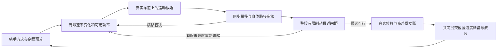
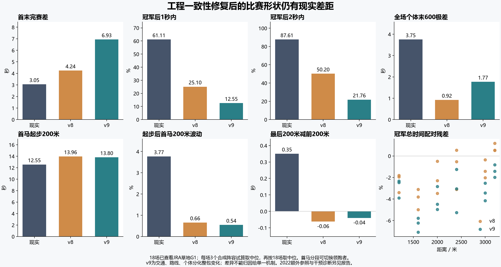

# 系统一致性与节奏诊断 · v2026.10.02.3

数值快照SHA-256：`3b837b46bf03ed86a19fdbe0ff83a03bb4fd2211ff9a4692b2f1a78e12f221ff`。基线提交`582ce9046dd8552d950d0296e8500a8234388eff`。源码哈希统一将CRLF转为LF，保留文件其余字符；整源等价比较使用同一口径。本轮没有搜索全局参数、添加跑法奖励或逐距离补偿。

当前代码SHA-256：`51caabc1395b62a325f3048aa923994516310d8c69665f3fd17b89978615b82a`。相对数值快照增加旧连续马群入口的迁移、档案脱离拷贝两行，以及一处分道边界遥测赋值判定；逆去这三处，**整个源文件逐字恢复数值快照**。入口不参与冻结阵容或`createRace`测量。仅过滤两项遥测最小值的记录，原跟车查询条件、调用顺序与持久负证缓存写入保持相同；异常种子4410帧的马匹、控制、账本、查询/缓存序列与结果逐值相等。完整矩阵保留原哈希和原负值；生产入口另经4项回归与6距离单马等价检查。见[整源等价记录](source-snapshot-equivalence-v9.json)和[分道边界审计](traffic-slack-boundary-v9.json)。

**结论：运动交通、路线共用与个体档案通过限定范围内的工程检查；原始矩阵的单项遥测误报保留为失败，经独立审计修正后仍通过原工程门槛。比赛节奏、群体密集程度和逐马末段仍未整体拟合现实。**

综合时间与工程验收：**未通过**。主参照旧时间门槛：未通过；新增2022时间门槛：未通过。七项形状指标仍有现实残差；即使上述宽松时间门槛通过，也不等于整场拟合完成。

## 实现

- 同步审核双方横移路径、有限制动的未来最小身体间距和供能约束；实际运动、预测停距使用同一实际车道弧长。取消事后位置/速度硬夹，修复外道入弯和不规则帧步下的可行域丢失。闸位与身体包络按有效宽度布置；过量阵容、真实不可行的人工状态明确拒绝。[交通说明](traffic-consistency-v9-2026-10-02.md)

- 页面捕获求解失败并停止推进，显示具体原因、保留诊断和未结算注单；失败结果及构造失败前的旧比赛都不能进入结算。自动周模拟中已完成的场次保持结算身份，重试不会重复支付。真实Edge异常回归10项通过，数值引擎未因此修改。[页面失败回归](page-race-failure-v9.json)

- 14个官方尺寸约束布局加入连续变曲率、官方幅员下界、发走引入线和已知首弯/坡段锚点；物理、骑手预测、风向与小地图共用路线。修复第一弯道接直道时航向角跨越±π的分支跳变，避免微小路段被计为上百米。小地图显示圈道和引入线；Edge像素截图核对。未知地形、空间地面、移栏、混合内外圈仍是代理。[路线说明](route-detail-v2026.10.02.3.md)

- 持久化五轴个体生理，分离持续供给、短时容量/功率、经济性、供能建立及疲劳耐受；稳定迁移，训练不重抽，繁育与存档传递。容量/有氧不再只有同一条体质通道，但基准仍保留原属性映射，范围尚未用逐马实测估计。[个体说明](individual-physiology-v2026.10.02.3.md)

## 口径与工程验收

新旧各288场，共576场完整配对试算。270场主矩阵含216场合成对照、18个已查看2023–2025赛事各3次试算；另加6场2022赛事各3次，2022新增参照预先固定、未按误差筛选。再做12正常马群+192固定原指令独马+12中性档案的216场干预试算，192匹共同内线独马与12次原单跑精确复现，以及30个仅跑到200米的起步试算。机制回归、开发探针不加入上述正式场数。

每个新旧配对使用发布版v8生成的同一阵容，统一能力、性格、策略、初始状态与分离的生成/比赛随机流。G1仅为合成86档映射，全场同冠军负重、480kg、健康、优秀骑手、静风；并非逐马复演。每场3次先取中位，再以真实场次为统计单位，不能当作54或18场独立现实比赛。

| 验收 | 主矩阵 | 2022外部参照 |
|---|---:|---:|
| 原始记录综合工程验收 | 未通过（遥测误报） | 通过 |
| 遥测独立审计后沿用原工程门槛 | 通过 | 通过 |
| 身体侵入场数 | 0 | 0 |
| 全部内部步最低速度模长变化率/m/s² | -3.500000 | -3.500000 |
| 做功账最大误差/J/kg | 2.01e-10 | 1.29e-10 |
| 原始停止身体余量记录/m | -1.95417598 | 0.23925695 |
| 审计后保守余量下界/m | 0.21012297 | 0.23925695 |

主矩阵只有一个种子记录负值。它的横向间隔距0.855米判定边界差约5.82×10⁻¹⁴米；原遥测使用裸小于号，求解器已用1纳米边界容差，导致已分道的马被计入虚构同道停距。身体实际横向余量约0.10米。修复仅令遥测复用原求解器判定，未改变求解器或物理容差。该场全4410帧运动、账本与结果不变，修正后该场最低余量0.27697650米；其余269场原正值作为更窄判定的保守下界，合计下界0.21012297米，仍按≥−10⁻⁶米原门槛验收。**这不是在生产哈希上重跑270场；原始失败与数据未覆盖。** [边界与完整回放证据](traffic-slack-boundary-v9.json)。

旧版270场最低加速度-1137.57m/s²，身体侵入记录涉及195场。旧宽度与闸距不兼容会在发走时重叠，故此场数不能解读为195次途中接触事故；两处旧交通瞬停种子另外有精确回放证据。3.5m/s²是保留的引擎约束，未声称实测马群制动参数。

早期开发版本曾在完整页面及主矩阵失败，随后定位到直道/外道弯道中途最近接近、粗采样相位和实际/预测弧长换算不一致。失败与源有变化的试算未冒充正式通过记录；新冻结矩阵重新执行。

本轮一致性验证针对现有60Hz离散模型中的路径、身体间距和供能同账。3.5m/s²限制速度模长下降率；横移目前只有速度上限，没有持续的侧向速度或偏航状态，否决、停止或反向可即时改变侧速。弯道上限约束固定车道向心需求，未与横移加速度及推进/制动合并成统一附着包络。因此，完整二维动力学和真实转向过程仍未验证。

出闸反应刚结束时可能仅活动内部步的一部分；当前势能与动能按实际状态差计费，阻力仍用整步平均速度及时长近似。账本闭合不等于连续时间积分无误，后续应以活动子步与步长收敛核查该边界；不应把这个很小的初始积分误差当成首200米现实残差的主要解释。

另有500组独立制动状态（含100组临界弯道）：64组中途比首末更接近，1467495项逐单元倍率及73530项真实弧长度量包络检查通过，完整局部求根相对5毫秒细网格最大乐观误差4.18e-8米。正向早退只在保守界证明安全时执行；负证仅拒绝候选，不能污染完整间距缓存。Bezier导数界有数学依据，极小值搜索仍是有限数值覆盖。[独立检查](traffic-domain-review-v9.json)

航向角回归覆盖21布局/起点路线，旧源复现785项异常，新源0项；跨接点弧长推进反解最大误差9.68e-10米。原先2π分支跳变曾把纳米级进度映射成最多146.4米的推进偏差。该修复消除数值不连续，不能解释成真实赛道测绘精度。[微边界回归](route-heading-junction-v9.json)

安全优化与精确缓存对照同一修复后路线：6个密集短场景及完整1200/3200米，共22722帧，全部马的运动、储备、指令、最终时间和分段逐值相同；保守余量诊断允许不同。8场景中最终单步P95最大17.5毫秒、最大步284.5毫秒；这是有并发负载的Node测时，不能宣称浏览器60FPS已达标。求根28次精度未降低。[最终性能与等价记录](traffic-optimized-final-v9.md)

## 七项现实残差

现实数据为JRA官方逐马时间和首马200米分段；首馬200米可以切换领跑者，不是冠军自身速度。现实仅计算完赛者；中止保留在出走数。CV统一用0.1秒分辨率，其余模拟时差保留原精度。比较的整包同时改变交通、路线和个体机制，不能把新旧差异归因一个子系统。

| 每场计算再取18场中位 | 现实 | v8 | v9 |
|---|---:|---:|---:|
| 首末完赛时间差/s | 3.050 | 4.242 | 6.933 |
| 冠军后1秒内完赛比例/% | 61.111 | 25.098 | 12.549 |
| 冠军后2秒内完赛比例/% | 87.605 | 50.196 | 21.765 |
| 全场个体末600米极差/s | 3.750 | 0.919 | 1.767 |
| 首马起步200米/s | 12.550 | 13.955 | 13.799 |
| 起步后首马200米分段CV/% | 3.767 | 0.657 | 0.544 |
| 最后200米减前200米/s | 0.350 | -0.062 | -0.040 |

## 完赛时间、速度、马身与位置标签

每个距离含3个真实赛事；模拟每个赛事先对3次试算取中位，再跨真实赛事取中位。平均速度为比赛距离/冠军总时；最快200米速度为首马最快一段的200/分段时间，可能涉及不同领跑者，不能与60Hz瞬时峰值混比。

| 距离/m | 冠军总时/s（现实/v8/v9） | 冠军均速/m/s（现实/v8/v9） | 首马最快200米均速/m/s（现实/v8/v9） |
|---:|---:|---:|---:|
| 1200 | 67.000/65.689/65.343 | 17.910/18.268/18.365 | 19.231/19.156/19.238 |
| 1600 | 92.300/88.072/86.139 | 17.335/18.167/18.575 | 18.182/18.802/19.360 |
| 2000 | 117.300/114.617/112.047 | 17.050/17.449/17.850 | 18.182/18.228/18.556 |
| 2400 | 141.800/141.045/137.850 | 16.925/17.016/17.410 | 18.519/17.695/17.982 |
| 3000 | 184.000/180.505/176.785 | 16.304/16.620/16.970 | 17.391/17.050/17.464 |
| 3200 | 194.200/195.206/191.429 | 16.478/16.393/16.716 | 17.544/16.793/17.081 |

冠军—亚军着差保留官方鼻、头、颈类别，不填入自造的数值马身。模拟使用冠军过线瞬间的进度差/2.4米，按每赛3次中位分箱；这是名义长度代理，与官方着差存在测量、舍入和体长定义差异。以下为18个赛事等权计数，未识别值单列。

| 冠军—亚军着差类别 | 现实赛事数 | v8赛事数 | v9赛事数 |
|---|---:|---:|---:|
| <1 | 8 | 1 | 2 |
| 1–3 | 8 | 13 | 7 |
| >3 | 2 | 4 | 9 |
| unknown | 0 | 0 | 0 |

模拟原生官方布局、70档16马组，每距离12场。表格为“胜数/该位置型出走数（比例）”；标签来自比赛中的平均相对位置，属于赛后形成的分组。它描述胜出关联，不能当作随机指定跑法的因果胜率，也不与现实最后一个弯道位置标签混用。种子跨距离复用，不能将所有出走视作独立样本。

| 距离/m | 逃 | 先 | 差 | 追 |
|---:|---:|---:|---:|---:|
| 1200 | 12/28（42.9%） | 0/59（0.0%） | 0/63（0.0%） | 0/42（0.0%） |
| 1600 | 10/31（32.3%） | 2/56（3.6%） | 0/57（0.0%） | 0/48（0.0%） |
| 2000 | 11/31（35.5%） | 1/57（1.8%） | 0/57（0.0%） | 0/47（0.0%） |
| 2400 | 11/29（37.9%） | 1/55（1.8%） | 0/60（0.0%） | 0/48（0.0%） |
| 3000 | 10/30（33.3%） | 2/55（3.6%） | 0/60（0.0%） | 0/47（0.0%） |
| 3200 | 11/30（36.7%） | 1/57（1.8%） | 0/57（0.0%） | 0/48（0.0%） |

个体末段分化增大并不等于拟合成功；更大的持续能力差异也会累计成更大的全程差距。紧密完赛比例、分段波动和末段形状应与总时间共同评价。

### 前段与末段的相互抵消

对同场每匹完赛马，`总时间T = 到末600起点的时间A + 个体末600时间B`，所以`Var(T)=Var(A)+Var(B)+2Cov(A,B)`。若前段用时较长的马末段较快，协方差为负，两段差异会抵消；若两段都较慢，则积累成总差距。两种极差的跨场中位本身不能识别这个关系。

| 24个真实赛事等权中位 | 现实 | v8每赛3次中位 | v9每赛3次中位 |
|---|---:|---:|---:|
| 前段与末600相关系数 | -0.412 | 0.131 | 0.837 |
| 方差抵消指数 | 0.325 | -0.046 | -0.439 |
| 到末600入口用时方差/s² | 0.172 | 1.369 | 3.006 |
| 个体末600用时方差/s² | 0.707 | 0.060 | 0.277 |

| 距离/m（每距4个现实事件） | 前段/末600相关：现实 | v8 | v9 |
|---:|---:|---:|---:|
| 1200 | -0.771 | 0.216 | 0.917 |
| 1600 | -0.601 | -0.004 | 0.785 |
| 2000 | -0.867 | 0.052 | 0.856 |
| 2400 | -0.234 | 0.221 | 0.842 |
| 3000 | -0.150 | 0.317 | 0.829 |
| 3200 | 0.211 | -0.012 | 0.812 |

现实总体中位为负不表示所有距离或赛事都必须为负；3200米参照组中位为正。这里只检查前段差异如何与末段交叉，不能把负相关当作需要硬编码的目标。各方差的跨场中位也不能直接代入同场方差恒等式相加。

现实396出走、391完赛，具有总时/个体末600的配对马391匹；每场分别计算，再等权汇总。上表把模拟总时和末600分别量化至现实0.1秒精度后再相减，未定义的相关系数保留空值，不填0。指数为−2Cov/(VarA+VarB)，正值表示抵消、负值表示放大；原精度敏感性、各场有效n和逐项方差见[只读分解](pace-covariance-v9.json)。
这个分解描述现象，不能单独证明主动等待或疲劳机制；A同时含出闸、前段路线、指令和交通史。若模型缺少能交叉的出力史，只增大稳定个体能力差异往往会同时放大前段与后段，不能自动生成现实的末段补偿。

同马的总时与末600均是官方舍入测量，相减形成的A会共享测量误差；方差恒等式接近0只说明统计计算自洽，不是物理验收。模拟的同距离种子也跨年份复用同阵容，事件等权汇总不表示这些合成马群相互独立。直道入口位置分箱和赛后平均位置标签只能描述胜出关联，不能当成先验跑法随机分组或跑法的因果胜率。

| 绝对相对误差/% | v8中位/最大 | v9中位/最大 |
|---|---:|---:|
| winnerTime | 1.883/4.993 | 3.251/7.078 |
| winnerFinal600 | 2.724/8.442 | 2.693/9.108 |
| first600 | 3.578/11.636 | 2.983/9.748 |

沿用旧版的宽松检查：逐场冠军总时≤5%、冠军末600≤10%、首马前600≤10%。这些检查不覆盖七项比赛形状指标，也不会被本轮改成事后更宽阈值。

- winnerTime最大误差7.078%，旧阈值5%：**未通过**。
- winnerFinal600最大误差9.108%，旧阈值10%：**通过**。
- first600最大误差9.748%，旧阈值10%：**通过**。

新增2022参照：

| 指标中位 | 现实 | v8 | v9 |
|---|---:|---:|---:|
| 首末完赛时间差/s | 2.200 | 5.310 | 8.680 |
| 冠军后1秒内完赛比例/% | 71.111 | 27.222 | 8.889 |
| 冠军后2秒内完赛比例/% | 97.222 | 47.222 | 21.667 |
| 全场个体末600米极差/s | 3.150 | 0.813 | 2.227 |
| 首马起步200米/s | 12.450 | 13.911 | 13.761 |
| 起步后首马200米分段CV/% | 4.466 | 0.636 | 0.536 |
| 最后200米减前200米/s | 0.550 | -0.058 | -0.031 |

2022仅6个真实事件，重复种子不增加独立现实样本；3000/3200米在阪神，3200外→内仍为混合路线代理。来源、逐马与中止见[冻结官方参照](system-external-reference-2022.md)。

2022沿用相同时间门槛：

- winnerTime最大误差5.595%，门槛5%：**未通过**。
- winnerFinal600最大误差8.577%，门槛10%：**通过**。
- first600最大误差8.253%，门槛10%：**通过**。

## 固定原指令回放：执行还是指令

正常马群每60Hz帧记录骑手速度/横移指令变化，再让每匹马独跑，保留该马原闸位横向位置、反应延迟、偏差、体质和原墙钟指令。这个干预同时去掉身体交通和尾流，实际横移受阻也会变化；不是重新骑乘、相同空间路线或完整竞争策略反事实。原指令已经包含交通对AI的影响，所以直接执行差异较小，也不能排除交通通过走位和骑手选择产生的间接效应。若超过原马完赛帧，保持最终指令，延长量逐马保留。

| 12场诊断中位 | 正常马群 | 固定指令独跑组 | 中性档案马群 |
|---|---:|---:|---:|
| 首末完赛时间差/s | 8.095 | 8.192 | 3.930 |
| 冠军后1秒内完赛比例/% | 21.875 | 21.875 | 21.875 |
| 冠军后2秒内完赛比例/% | 34.375 | 31.250 | 56.250 |
| 全场个体末600米极差/s | 1.713 | 1.703 | 0.873 |
| 首马起步200米/s | 13.836 | 13.836 | 13.908 |
| 起步后首马200米分段CV/% | 0.449 | 0.453 | 0.511 |
| 最后200米减前200米/s | -0.029 | -0.010 | -0.037 |

三列中位之差不等于配对差的中位；以下报告逐场干预配对差：

- 去掉交通与尾流后，正常马群−独跑的首末差配对中位-0.050秒，末600极差配对中位-0.002秒。
- 正常−中性档案的首末差配对中位3.408秒，末600极差配对中位0.940秒。这个对照仅移除新潜在生理轴，保留当前属性映射和会重新决策的AI。
- 逐马起步后目标速度CV中位0.8%；第二半程−第一半程平均目标速度中位0.098m/s。
- 逐马完赛储备比例中位3.5%，保持系数中位0.963；全部模式累计秒数见JSON，不能以模式名称代替实际速度。

全距离的模式秒数会被长距离比赛加权，不能概括短途。以下每距离含2场、32匹；储备与目标速度CV按逐马取中位，实际速度CV来自起步200米之后的每秒快照，模式比例按该距离全部骑乘秒数计算。它与首马200米分段CV的采样及对象不同。

| 距离/m | 完赛储备 | 目标速度CV | 实际速度CV/每秒快照 | 攻击模式占时 | 巡航/跟随模式占时 |
|---:|---:|---:|---:|---:|---:|
| 1200 | 22.5% | 0.0% | 0.6% | 87.4% | 2.4% |
| 1600 | 5.7% | 1.7% | 0.8% | 17.8% | 65.4% |
| 2000 | 3.8% | 0.9% | 0.8% | 0.7% | 90.7% |
| 2400 | 3.1% | 0.8% | 0.7% | 0.0% | 94.6% |
| 3000 | 2.5% | 0.8% | 0.7% | 0.3% | 94.9% |
| 3200 | 2.4% | 0.7% | 0.7% | 0.0% | 96.1% |

1200米几乎恒定的攻击请求仍留下较多储备；剩余能量不自动等于可以转成更高速度。需分别检查预算请求、可用释放功率、速度上限和实际供能约束。长途完赛储备较少也不证明配速选择正确。不能把全距离汇总概括为一直攻击，或概括为没有剩余能量。

## 同一内线：路线执行的贡献

在前述192匹独马回放上，再固定初始横向位置及所有横移目标为路线参考内线1.4米；原墙钟速度指令、原闸号/反应延迟、偏差、体质、负重和场地不变。每组先完整复现一匹原独马，全部分段与生理记录逐值一致，再执行干预。它同时移除不同横向路径和转向，包含弯道/坡道时序及疲劳反馈；并非16匹共线真实比赛、重新骑乘或纯几何距离变化。

| 12组独跑中位 | 原路线独跑 | 同一内线独跑 |
|---|---:|---:|
| 首末完赛时间差/s | 8.192 | 6.525 |
| 冠军后1秒内完赛比例/% | 21.875 | 18.750 |
| 冠军后2秒内完赛比例/% | 31.250 | 37.500 |
| 全场个体末600米极差/s | 1.703 | 1.695 |
| 首马起步200米/s | 13.836 | 13.813 |
| 起步后首马200米分段CV/% | 0.453 | 0.555 |
| 最后200米减前200米/s | -0.010 | 0.031 |

逐组原路线−同内线的首末差配对中位1.576秒；逐马时间变化中位1.210秒，最大4.437秒。起步200米配对中位仅0.00172秒。路线差异的贡献不能当作身体受阻耗时，受阻秒数也不等于损失秒数。各距离、每匹配对见[路径干预](path-isolation-v9.json)。
当前骑手已在弯道或无前马时尝试向内移动，邻马并排时会保持。缺少联合纵横动作序列：稍收力让邻马前出、切入内线、再推进。`finishPlan`又固定当前车道，局部横移成本没有比较后续整段路线收益。因此优先测试弯前两马的“让行换线”与当前启发式，再扩展到16马双方重规划；不能直接取消安全空档要求。

路线规划还需与有限转向响应共同设计：传播侧向速度/偏航状态，把弯道和换线的侧向需求与推进/制动放入同一附着约束，再同步修改未来避碰轨迹。这个代码缺项已确认，但对七项节奏指标的贡献需要独立干预，不能把全部残差归给转向。

发走机也是未标定代理：目前闸距随有效赛道宽度变化，上限1.6米。现实使用有固定设备尺寸的闸机，赛道幅员不能直接推出闸距。[JRA设备历史](https://www.jra.go.jp/kouza/yougo/w468.html)与[实际JSS发走机资料](https://www.arr.or.jp/biz/facility/kizai/_pdf/20240930.pdf?ver=1.0.0)可以约束下一轮重建；整机外长含框架与轮架，不能除以马数当净闸距。需同时识别闸机位置、起点引入线与合法合流路径，当前代理可能放大路线损失。

## 起步识别

6个同条件独马起步×5种干预，只跑至200米。最大目标30m/s仅用于测量当前物理上界，并非现实策略；100%初始供氧不等于实测预热；加速/储备功率+25%只是敏感性，不修改正式参数。

| 干预 | 首200米中位/s |
|---|---:|
| normal-ai | 13.699 |
| maximum-request | 13.283 |
| maximum-warm-oxygen | 13.277 |
| maximum-acceleration-plus25 | 12.815 |
| maximum-reserve-power-plus25 | 13.283 |

正常AI可以改变横向目标，固定最大请求同时保持原车道；这个对照含不同转向执行，不能纯归因为目标速度。

最大请求下，完全建立初始供氧的成对改善中位0.006秒，提高短时释放功率25%的成对改善0.000秒；加速上限与运行加速度同时提高25%的成对改善中位0.466秒。原AI相对最大请求的成对多用时间，在1200米为0.016秒，2400米为1.089秒。不能把混合两距离的中位数之差当成各距离的AI影响。该敏感性把现协议中的主要限制指向请求和加速响应，不能据此推荐直接加25%，也不能把缺预热定为主因。下一轮需同时匹配200/400/600米和逐秒速度，而非只校正一个首200点。

## 受控出力史：现有生理是否能表达差异

同一中性70马、固定参考车道、无AI/对手/尾流；1200/2400米×中段基准请求14.5/16.5m/s共4个预声明条件。中段比较常数与先快后慢/先慢后快的正弦波，前200和最后600均请求当前上限。157次独跑含局部做功匹配的搜索执行，4/8条历史通过整场等做功匹配，其他失败原样保留。距离波形仅为诊断输入，未加入生产机制。

| 距离/m | 中段基准/m/s | 常数末600/s | 先快后慢末600差/s | 先慢后快末600差/s | 常数进入末600储备 |
|---:|---:|---:|---:|---:|---:|
| 1200 | 14.5 | 32.970 | 0.031 | -0.027 | 68.1% |
| 1200 | 16.5 | 33.189 | 0.006 | -0.025 | 52.0% |
| 2400 | 14.5 | 34.026 | 0.409 | 0.284 | 47.9% |
| 2400 | 16.5 | 44.085 | 0.004 | -0.010 | 0.0% |

上表保持相同中段请求均值，**没有匹配整场做功**。它显示改变需求史可以形成不同储备入口和末段；储备耗尽的长距条件则收敛到近似供能上限。通过的局部等做功匹配中，末600变化最大约0.030秒；匹配同时调整了中段均值，不能解释为仅改变先后顺序的纯效应，也不能据此决定真实战术优劣。

做功对请求可能因总时间、有氧支出与储备耗尽反馈而不单调，最终整帧账本也存在最多1/60秒的计时边界。搜索只接受有限采样支持的局部单调括区；未扩大范围、丢弃失败或改变生产参数。现有生理已有历史响应；这些单马诊断条件下变化较小，尚不能与现实异质马群的末段极差直接比较，也不能据此判定生理表达能力不足。[完整协议与失败记录](effort-history-v9.md)

## 系统缺项与下一步方案

继续分离“物理是否能表达”与“骑手是否会选择”：将上述固定单马波形诊断扩展到真实参数范围和状态触发的对手情境，检查储备释放、疲劳、路线与前后段补偿。生产动作由对手、通道、余力和路线状态触发，不恢复固定距离阶段。

旧参数曾与不一致的交通结算共同形成赛时；修正运动后需要重新识别参数。仅凭冠军总时无法区分物理能力尺度、合成阵容与骑手配速选择，不能立即按每距离误差反向补偿。

1. **预测和执行的疲劳要一致。** `finishPlan`冻结当前保持系数、车道与起始加速余力；实际运行持续消耗耐受并降低有氧供给。在预测中传播未来供给、储备释放、耐受与有限恢复，再对同一预设出力序列逐步回放。先验证预测误差，不用末段倍率补偿。它可能影响末200形状和末600分化，但贡献还须单机制配对确认。

2. **联合路线、出力与对手响应。** 目前`budgetSpeed`搜索一个余程请求速度，跟随/抢位主要在局部8秒内比较，储备通常按96%—98.5%分配。先比较让行→换线→推进、先跟随→响应抢位→再提速等状态触发候选序列，并分别试验个人最快完赛与获胜收益目标。使用同马群/路线/总成本，观察CV、1/2秒聚集、位置交换、末段和总时共同变化。不要恢复固定百分比赛段。

3. **把马自身的动态行为与骑手请求分开。** 当前性格是固定前进/安定/服从参数，缺少随拥挤、竞争、受阻演化的兴奋与抗拒状态。若固定指令仍平稳，应先识别物理响应；若目标本身平稳，再比较动态行为对目标执行偏差和额外耗能的贡献。行为状态需要恢复时间和触发依据，不能每帧加白噪声制造波动。

4. **以真实出赛群体识别个体分布和起步。** 合成86级和独立档案轴不是实际G1入选马群；现有生成器还人为指定一匹所有属性+2的强马。生涯已有年龄、战绩、平均能力与出赛间隔筛选，但合成基准没有现实赛级/距离下的联合分布。应以同马多距离/多次表现估计供给、容量、经济性与状态的协方差，再校验赛级、距离与备赛条件选拔。起步则联合200/400/600米和逐秒加速识别反应、响应、供能初态及有限功率；不能只调整加速度把首200对上。

七项指标对应关系：尾差与1/2秒密集要分开检查不同路径、竞争目标、能力联合分布与阵容筛选；末600极差检查出力史、疲劳预测和个体分布；首200优先检查请求与加速响应，并检验初态/可用功率；post200CV检查多动作和对手响应；last200差检查早期竞争消耗、未来疲劳/储备释放与实际终点坡道。前述是已确认代码限制和待验证的机制解释，不能据7个汇总量唯一识别现实生理。

当前数学研究将速度、推进、无氧储备与有氧供給组成随时间演化的最优控制；本项目的单请求速度预算仍是简化。[Mercier & Aftalion 2020](https://journals.plos.org/plosone/article?id=10.1371/journal.pone.0235024)。下一轮若依据这些参照继续改模型，应增加未用于设计的赛场、级别、泥地与同马纵向资料。

## 数据与复现

- [完整比较JSON](system-reality-comparison-v2026.10.02.3.json)
- [旧版270场](system-baseline-v2026.10.02.3.json.gz) / [新版270场](system-current-v2026.10.02.3.json.gz)
- [2022旧版18次](system-baseline-external2022-v2026.10.02.3.json.gz) / [2022新版18次](system-current-external2022-v2026.10.02.3.json.gz)
- [固定指令与中性档案干预](tempo-system-v9.json) / [起步干预](start-system-v9.json)
- [同内线执行干预](path-isolation-v9.json) / [数值源码快照](system-numeric-source-3b837b-v9.js.gz)
- [弯道衔接微边界回归](route-heading-junction-v9.json) / [最终交通优化等价检查](traffic-optimized-final-v9.json)
- [旧源码中断记录](interrupted-source44-v9.json)：保存35/270、12/18及8/12的开发进度；没有用于正式统计或换成新源码哈希。
- [前段/末段方差分解](pace-covariance-v9.json) / [只读分析脚本](../tests/pace-covariance-v9.js)
- [受控出力史](effort-history-v9.md) / [包括匹配失败的原始数据](effort-history-v9.json)
- [系统试算脚本](../tests/system-reality-v9.js) / [节奏脚本](../tests/tempo-system-v9.js) / [起步脚本](../tests/start-system-v9.js)

完整大JSON采用无损gzip归档；读取工具支持原文件和归档自动回退。历史诊断脚本从Git冻结提交在内存加载v8，无须替换当前源文件；原历史完整1026场记录仍保留，不与这次配对统计重复合并。正式命令见README。
